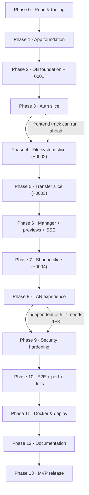

# LocalDrop Implementation Plan

**Version:** 1.0 · **Date:** 2026-10-01 · **Status:** Active — execution roadmap
**Source of truth:** [docs/spec/](docs/README.md) (Master Specification) + [ADRs](docs/adr/ADR-001-backend-framework.md)
**Role of this document:** convert the approved specification into a phase-by-phase
execution plan that any developer or AI coding agent can follow without redesigning
the architecture. It does not replace the spec — where this document and the spec
disagree, **the spec wins** and this document must be corrected.

---

## 1. Executive Summary

LocalDrop v1 is a **single-owner, self-hosted file drop box**: FastAPI (one process)
+ PostgreSQL 16 + content-addressed filesystem blob store + React/Vite SPA, deployed
as two Docker containers. Uploads use a native tus 1.0.0 subset; downloads stream
with HTTP range support; sharing is public links with expiry/password/limits/QR.
No Redis, no nginx container, no microservices, no telemetry.

Delivery is organized as **14 phases** (0–13). Phases 0–2 build the foundation
(repo/tooling, app skeleton, database core). Phases 3–8 are **vertical slices** —
each one ships backend + database + frontend + tests for one working feature
(authentication → file system → transfer → file manager → sharing → LAN).
Phases 9–13 harden, test, deploy, document, and release. Work tracks into **7
milestones** and **31 tracked issues** (LD-001…LD-031). The definition of done and
the AI-agent rules at the end are binding on all contributions.

**Prerequisites resolved during planning (research, 2026-09-30):**
- Starlette `FileResponse` supports HTTP Range since 0.39.0; a 2025 advisory
  (GHSA-7f5h-v6xp-fcq8 / CVE-2025-62727) fixed an O(n²) DoS in multi-range header
  parsing. **Consequence:** pin Starlette ≥ the release containing that fix
  (verify exact version at Phase 5 start) *and* keep the spec's single-range-only
  policy, which sidesteps the vulnerability class entirely. Spec item V1 is thereby
  narrowed, not closed (perf still needs the L5 harness).
- No maintained pure-Python tus server exists (`fastapi-tusd` shells out to the Go
  `tusd` binary — a sidecar, which violates BC-1). **Consequence:** ADR-005's
  native-implementation decision is confirmed; budget ~300–500 LOC + the L2 suite.

---

## 2. MVP Scope

The MVP is the spec's v1.0.0 definition (spec 02 §5): **a single-owner drop box**.
Personas A (home user), B (developer via API), and D (self-hoster) are fully served;
Persona C (teams) waits for Phase 2 of the roadmap.

### MUST HAVE (v1.0.0 — nothing ships without these)

- First-run onboarding via console setup token → owner account (FR-A1)
- Login/logout, DB sessions with idle+absolute expiry, session list/revoke (FR-A2/A3)
- Password change; personal access tokens with `read|write` scopes (FR-A4/A5)
- Folders: create/rename/move/delete/restore (virtual tree in DB) (FR-F2/F3)
- Files: rename/move/copy/delete (soft-delete + 30-day trash), multi-select,
  bulk actions (FR-F3/F4)
- **Resumable chunked uploads** (tus subset): create/offset/append/cancel,
  per-chunk sha256 checksum, survives client reload and server restart (FR-T1/T2)
- Upload progress, cancel, retry, bounded concurrency in UI (FR-T3)
- **Streaming downloads** with Range/If-Range/ETag resume (FR-T4)
- Max-upload-size config + clear rejection (FR-T5); content dedup (FR-F6)
- Share links: expiry, download limit, password, revoke, usage counters, QR (FR-S1–S4)
- Previews: image thumbnails + lightbox, PDF embed, capped text, AV native player;
  icon-only for everything else (FR-P1–P5)
- Search (pg_trgm), sort, filter (FR-F5)
- Health/live + health/ready + Prometheus metrics + structured JSON logs (FR-O1–O3)
- LAN onboarding: startup URL + QR print, opt-in mDNS, honest platform matrix
  (FR-L1–L3)
- Docker Compose production stack (app + postgres, hardened), multi-arch images
- Backup/restore documented and CI-drilled; WCAG 2.2 AA on core pages; zero
  outbound network calls; full L1–L4 test suites green

### SHOULD HAVE (first post-1.0 release train — designed for, not built early)

- Multi-user accounts, admin-created; opt-in registration flag (FR-A7)
- Per-folder sharing to users (viewer/editor) + public folder shares (FR-S5/S6)
- Per-user/instance quotas (FR-F7); admin dashboard UI (FR-O4/O5)
- Email password reset / verification via optional SMTP (FR-A6)
- Folder/multi-select zip download, streamed (FR-T6)
- UI locale extraction ≥ 2 additional languages (spec 07 §5)
- Audit log browsing/export in UI (FR-O7)

### FUTURE (explicitly out of MVP — do not implement early; BC-20)

CLI (08 §11) · plugin system · S3/MinIO storage backend · multi-volume storage ·
OAuth/OIDC · video filmstrip thumbnails · office previews · virus-scan sidecar ·
E2EE vault · SSDP discovery · WebSocket. Each has a designed seam; none has a v1
code path.

**Ruthless-scope rule:** any PR that adds a FUTURE item "while we're here" is
rejected. Schema seams (nullable columns, status enums) may exist; code paths may not.

---

## 3. Architecture Summary

One-screen recap; normative detail lives in the spec (03–09) and ADRs.

```text
┌──────────────────────── localdrop (docker) ────────────────────────┐
│  FastAPI (Python 3.12) · single process · uvicorn                  │
│  ├── REST /api/v1 (OpenAPI 3.1, problem+json errors)               │
│  ├── tus-subset uploads → content-addressed blob store             │
│  ├── streaming downloads (Range/ETag, bounded RAM)                 │
│  ├── SSE /events + in-process job scheduler (hash/thumbs/GC)       │
│  └── serves built React/Vite SPA (static, fingerprinted)           │
│        │ SQLAlchemy 2.0 + Alembic            │ /data volume        │
└────────┼─────────────────────────────────────┼─────────────────────┘
    ┌────▼──────────┐                  ┌─────────▼────────┐
    │ PostgreSQL 16 │                  │ blobs/ staging/  │
    └───────────────┘                  │ thumbs/          │
                                       └──────────────────┘
```

| Decision | Choice | ADR |
|---|---|---|
| Backend | FastAPI, single process, one worker | ADR-001 |
| Database | PostgreSQL 16 + SQLAlchemy 2.0 + Alembic | ADR-002 |
| Infra | No Redis/broker — in-process jobs, limits, EventBus | ADR-003 |
| Storage | Content-addressed blobs (`blobs/ab/cd/<sha256>`), DB owns the tree | ADR-004 |
| Uploads | tus 1.0.0 subset, native implementation | ADR-005 |
| Realtime | SSE (+ polling fallback; no WebSocket) | ADR-006 |
| Auth | DB sessions + cookies + argon2id + PATs; object-level authz | ADR-007 |
| Frontend | React 18 + TS + Vite SPA, TanStack Router/Query, Tailwind + Radix | ADR-008 |
| Deployment | 2-container Compose, no proxy container | ADR-009 |
| License | AGPL-3.0 recommended — **[DECISION REQUIRED: D1, maintainer ratification]** | ADR-010 |

Non-negotiable invariants (BC-1…BC-24 in spec 11) are restated as agent rules in §20.

---

## 4. Development Principles

1. **Vertical slices over layers.** A phase is done when a user-visible feature
   works end-to-end (DB + API + UI + tests), not when a layer is "finished."
2. **Spec compliance is a test, not a vibe.** Every MVP requirement carries its
   FR id in test names; a CI script fails the build if an M-priority FR has no
   referencing test.
3. **The transfer path and the attack surface are tested first.** Upload lifecycle
   (L2) and the name/traversal corpora (L4) exist before the SPA does.
4. **Storage-first, DB-second.** Every DB+disk mutation writes storage first and
   commits rows second, so crashes leave GC-able orphans, never dangling rows
   (BC-7, spec 03 §5.5).
5. **Bounded RAM always.** No code path may buffer a whole file or request body;
   chunk loops only (BC-6).
6. **No user string ever reaches a filesystem path** (BC-3); names pass one
   `NameStr` validator everywhere (BC-11).
7. **Small, focused commits; every commit green** (lint + typecheck + affected
   tests pass).
8. **Boring technology, excellent implementation** (P7); every new runtime
   dependency needs one PR paragraph a maintainer could later cite as an ADR
   (BC-22).
9. **Docs drift is CI-detected** — OpenAPI freeze diff + config-table sync (BC-23).
10. **Ask, don't assume, on architecture.** Any change touching a BC clause, an
    ADR, or the API contract requires a written proposal (new/amended ADR) before
    code (agent rule A2).

---

## 5. Phase Plan

> Each phase lists: Goal · Dependencies · Tasks · Files to create · Files to modify ·
> Database / API / UI changes · Tests · Acceptance criteria. A phase is *complete*
> only when every acceptance criterion is demonstrably true on `main`.

---

### PHASE 0 — Repository & tooling

**Goal:** a reproducible, quality-gated workspace: clone → `make dev` → both stacks
run with hot reload; CI enforces lint/type/test on every PR. No product features yet.

**Dependencies:** none. **Status:** partially complete — git initialized on `main`
(spec commit `c5c3fdb`), `.gitignore` written, trunk-based workflow adopted.

**Tasks**
```text
[x] Initialize git repository (main + trunk-based branch model)
[x] Write .gitignore (secrets, venv, node_modules, data/, *.part)
[ ] Add LICENSE placeholder decision note (blocked on D1 — see §22)
[ ] Root Makefile (dev, lint, fmt, typecheck, test, seed, reset, doctor, up, down)
[ ] Backend scaffold: uv project, pyproject.toml (fastapi, uvicorn, sqlalchemy[asyncio],
    alembic, asyncpg, pydantic-settings, structlog, argon2-cffi, pillow, qrcode,
    python-magic, prometheus-client; dev: pytest, pytest-asyncio, httpx, hypothesis,
    ruff, mypy, pip-audit), src-layout backend/src/localdrop/
[ ] Configure ruff (lint+format), mypy --strict, pytest + coverage (fail-under 85)
[ ] Frontend scaffold: Vite react-ts, pnpm; deps: react-router → TanStack Router,
    @tanstack/react-query, tailwindcss, radix primitives, zustand, i18next,
    tus-js-client; dev: eslint (+jsx-a11y, no-dangerouslySetInnerHTML rule),
    prettier, vitest, @testing-library/react
[ ] .env.example with every LOCALDROP_* var documented (matches spec 03 §9)
[ ] CI: .github/workflows/ci.yml — backend job (ruff, mypy, pytest w/ postgres
    service), frontend job (eslint, tsc, vitest, build), openapi-freeze + docs-sync
    stubs; concurrency-cancel; pip/pnpm caching
[ ] PR template, bug/feature issue templates (yml), dependabot.yml (weekly, grouped)
[ ] .editorconfig, CONTRIBUTING.md stub ("docs/ is normative" + commands)
```

**Files to create:** `Makefile`, `backend/pyproject.toml`,
`backend/src/localdrop/__init__.py`, `frontend/` (Vite tree), `.env.example`,
`.github/workflows/ci.yml`, `.github/ISSUE_TEMPLATE/*`,
`.github/PULL_REQUEST_TEMPLATE.md`, `.github/dependabot.yml`, `.editorconfig`,
`CONTRIBUTING.md`.
**Files to modify:** `README.md` (dev quickstart), `docs/README.md` (plan link).
**Database changes:** —. **API changes:** —. **UI changes:** —.

**Tests:** CI green on its own skeleton (ruff/mypy/tsc/vitest/pytest all pass on
empty-but-wired projects; one canary unit test per side).
**Acceptance criteria:** fresh clone + `make doctor` reports exactly what's missing;
`make dev` boots backend (:8080) and frontend (:5173) with HMR; a PR touching either
side runs the right CI job in < 15 min.

---

### PHASE 1 — Application foundation

**Goal:** the FastAPI application exists and is observable: config system, request
IDs, structured logging, problem+json errors, health endpoints, SPA static serving,
the egress (no-outbound-connections) test. The API contract pipeline (OpenAPI
freeze) starts working.

**Dependencies:** Phase 0.

**Tasks**
```text
[ ] config.py: pydantic-settings, LOCALDROP_* env, validation (secret key ≥ 32 chars
    required unless DEV_MODE; prod refuses DEV_MODE), redacted startup config dump
[ ] main.py app factory: middlewares (request-id assign/propagate, structlog context,
    security-headers baseline, CORS gated to DEV_MODE :5173 only)
[ ] Exception handlers → RFC 9457 problem+json (catalog per spec 05 §3); unknown
    exceptions log full detail server-side, return request_id only
[ ] GET /api/v1/health/live (no DB) and /health/ready (DB roundtrip + storage
    writable + migration head; DB check lands Phase 2, stub before)
[ ] SPA static mount: / serves frontend/dist with immutable cache for hashed assets,
    non-cacheable index.html fallback; /api/* untouched
[ ] Structured logging: JSON default, dev key=value format; PII rules per spec 06 §2.15
[ ] OpenAPI freeze script + CI job (diff vs docs/openapi-v1.json)
[ ] Egress test: test_no_outbound_connections (fails suite if any socket connect
    leaves localhost during tests)
```

**Files to create:** `backend/src/localdrop/{main,config,logging,middleware,errors,health,staticfiles}.py`,
`backend/tests/{unit,integration}/…` (health, request-id, error-shape, egress),
`scripts/freeze_openapi.py`, `docs/openapi-v1.json`.
**Files to modify:** `backend/pyproject.toml` (entrypoint script), CI workflow.
**Database changes:** —.
**API changes:** `GET /api/v1/health/live`, `GET /api/v1/health/ready` (added).
**UI changes:** — (frontend still scaffold-only).

**Tests:** health endpoints; request-id present in logs + error bodies; problem+json
shape for 404/422/500; static SPA fallback serves index for unknown paths without
shadowing `/api`; egress test actively fails when a test makes an outbound call
(verified by an intentional canary in a dedicated marker).
**Acceptance criteria:** `curl localhost:8080/api/v1/health/ready` returns 200 JSON;
logs are JSON with `request_id`; a deliberately broken handler returns problem+json,
not a stack trace; OpenAPI freeze catches a seeded drift in CI.

---

### PHASE 2 — Database foundation + core auth schema

**Goal:** Alembic wired to async SQLAlchemy; engine/session/transaction helpers;
test database fixtures; **migration 0001** (extensions + users, sessions,
personal_access_tokens, audit_events, settings). Later migrations land with their
slices (§7) — this phase owns the infrastructure and the first migration.

**Dependencies:** Phase 1.

**Tasks**
```text
[ ] db.py: async engine (asyncpg), sessionmaker, unit-of-work helper, txn dependency
[ ] models/base.py: declarative base, UUIDv7 pk helper, created_at/updated_at mixins,
    naming-convention metadata (deterministic constraint names)
[ ] Alembic async setup; hand-written migrations only (autogenerate off; reviewed as code)
[ ] Migration 0001_core_auth: CREATE EXTENSION citext, pg_trgm; tables users,
    sessions, personal_access_tokens, audit_events, settings per spec 04 §3
    (columns, checks, partial unique indexes, BRIN on audit.created_at)
[ ] Test fixtures: per-test schema transaction rollback + postgres service container;
    factory helpers for users/sessions/tokens
[ ] scripts/seed.py skeleton (--wipe; adversarial-name corpus generator used later)
[ ] Repository pattern start: get_user_by_username, owned-fetch helpers namespace
```

**Files to create:** `backend/src/localdrop/db.py`, `backend/src/localdrop/models/*`,
`backend/migrations/versions/0001_core_auth.py`,
`backend/tests/conftest.py` (db fixtures), `backend/tests/factories.py`.
**Files to modify:** `backend/src/localdrop/health.py` (real DB/storage probes).
**Database changes:** migration `0001_core_auth` (full DDL per spec 04 §3.1–3.2,
3.3, 3.10, 3.11). **API changes:** —. **UI changes:** —.

**Tests:** migration up/down-to-zero/up idempotence; unique constraints fire
(duplicate username, duplicate live email); citext case-insensitivity; check
constraints reject bad roles; audit insert-only behavior; fixtures roll back cleanly.
**Acceptance criteria:** `make migrate` creates schema on a fresh postgres; the
constraint tests prove the DB enforces what the spec claims (spec 04 §5 invariants
1 subset); health/ready now reports DB truthfully.

---

### PHASE 3 — Authentication (vertical slice #1)

**Goal:** a real user can onboard, log in, stay logged in, manage sessions and PATs,
change their password — through both the API and the first real UI screens. Rate
limiting (auth class + identity lockout), CSRF middleware, and audit events ship
here because login is their first consumer.

**Dependencies:** Phase 2. *(Frontend tasks additionally depend on the Phase 0
frontend scaffold only — this slice is deliberately backend+frontend together.)*

**Tasks**
```text
[ ] services/auth.py: argon2id hash/verify (m=64 MiB, t=3, p=4; params in config),
    session mint (256-bit token, sha256-at-rest), rotation on login, idle+absolute
    expiry, revoke; PAT create/list/revoke (40-char token, sha256-at-rest, scopes)
[ ] Setup-token onboarding: 12-char token printed to console (15 min TTL, single
    use) once users table is empty; POST /setup/owner consumes it; all other
    endpoints 503 setup-pending until owner exists
[ ] POST /auth/login | /auth/logout; GET/DELETE /auth/sessions[/{id}]; GET/PATCH /me;
    PUT /me/password (revokes other sessions); /me/tokens CRUD
[ ] Principal resolution dependency: cookie session OR Bearer PAT → Principal
    (user_id, role, scopes); PAT rejected on SSE later (BC: tokens ≠ browser creds)
[ ] CSRF middleware: unsafe methods under cookie auth require X-Requested-With
    (spec 05 §1); Bearer exempt
[ ] Rate limiter service (in-process token bucket): class `auth` 10/5min per
    (IP + identity) with progressive lockout + audit; RateLimit-* headers;
    /64 IPv6 bucketing; X-Forwarded-For trusted only via LOCALDROP_TRUSTED_PROXIES (default 0)
[ ] Audit events: login, login_failed, logout, password_change, token_create/revoke,
    setup_completed
[ ] Frontend: typed API client (from OpenAPI) with CSRF header injection; /setup,
    /login pages; protected-route wrapper (401 → redirect); AppShell layout
    (sidebar/bottom tabs, topbar with user menu); account settings page (password
    change, sessions list w/ revoke, PAT create-once dialog); logout; toasts wired
    to problem+json detail; loading/empty/error states for each screen
```

**Files to create:** `backend/src/localdrop/services/{auth,ratelimit,audit}.py`,
`backend/src/localdrop/api/{auth,setup,me}.py`, `backend/src/localdrop/dependencies.py`,
migrations none (0001 covers), `frontend/src/features/auth/*`, `frontend/src/api/*`,
`frontend/src/components/ui/*` (button, input, card, dialog, toast, field),
`frontend/src/routes/{setup,login,settings.account}.tsx`, app shell components.
**Files to modify:** `backend/src/localdrop/main.py` (router wiring, middleware),
`frontend/src/routes/__root.tsx`.
**Database changes:** none (uses 0001). 
**API changes:** endpoints per spec 05 §2.2 (setup/status, setup/owner, login,
logout, sessions, me, me/password, me/tokens).
**UI changes:** setup, login, app shell, account settings — per spec 07 §1 routes.

**Tests:** L1 argon2 param sanity + token entropy; L2 full lifecycle (login → use →
idle expiry → absolute expiry → revoke; password change revokes others; PAT scopes
enforced per route class; lockout after 5 failures + reset; CSRF negatives —
cookie without header rejected, with header accepted, Bearer unaffected; setup
token single-use + TTL + 503 gating; audit rows written). L4: session fixation
(token rotates at login), cookie flag assertions (HttpOnly/SameSite/Secure-on-TLS),
rate-limit bypass attempts (XFF forgery ignored by default). E2E smoke:
onboarding → login → see shell → logout.
**Acceptance criteria:** from a clean DB, the printed setup token creates an owner
in the UI; login persists across reload; a second device's session is visible and
revocable; wrong-password lockout engages with `Retry-After`; no token value ever
appears in logs (redaction test).

---

### PHASE 4 — File system (vertical slice #2: tree + operations)

**Goal:** folders and files exist as *managed objects*: the Storage layer, name
validation, the full tree CRUD with trash, and the file browser UI showing seeded
content. Content transfer (bytes in/out) is Phase 5 — this slice proves the model,
the security layer, and the browser UX.

**Dependencies:** Phase 3 (auth for every route); migration 0002 lands here.

**Tasks**
```text
[ ] Migration 0002_storage_tree: folders, blobs, files (+ pg_trgm GIN on files.name)
    per spec 04 §3.4–3.6
[ ] storage/base.py: Storage protocol (open/append/read/stat/delete/rename/freespace)
    — the ONLY code allowed to touch LOCALDROP_DATA_DIR (BC-3)
[ ] storage/local.py: LocalFilesystemStorage — paths composed from UUIDs/hex only;
    Path.resolve() containment check on every open; O_NOFOLLOW (+ O_CREAT|O_EXCL on
    create); fsync file+dir helper; atomic os.replace
[ ] schemas/names.py: NameStr validator (NFC, no / \ NUL or control chars, no
    leading/trailing dot/space, ≤ 255 bytes, bidi/zero-width stripped) — single
    source, reused everywhere (BC-11)
[ ] folders service+routes: create/rename/move (cycle guard: new_parent not
    self/descendant)/delete (soft, subtree)/restore (collision-checked)/path
    (breadcrumbs)/children (mixed listing, cursor pagination, sort)
[ ] files service+routes: rename/move (409 + ?overwrite)/copy (same blob ref)/
    delete (soft)/restore; trash list + purge
[ ] Owner checks via owned-fetch helpers everywhere (BC-10); every route joined to
    the generated authz matrix test
[ ] scripts/seed.py: owner + 200-file tree incl. adversarial names (dev only)
[ ] Frontend: file browser core — virtualized list/grid (TanStack Virtual),
    breadcrumbs, create-folder dialog, rename, move dialog, delete→toast+undo
    (restore), empty states (empty folder / no results), optimistic updates with
    rollback; selection model (click/ctrl/shift, action bar); mobile action sheet
```

**Files to create:** `backend/src/localdrop/storage/{base,local}.py`,
`schemas/names.py`, `services/{folders,files}.py`, `api/{folders,files}.py`,
`models/{folder,blob,file}.py`, migration `0002_storage_tree.py`,
`backend/tests/security/test_name_corpus.py`, `test_traversal.py`,
`test_authz_matrix.py` (generator), `backend/tests/integration/test_folders_*.py`,
`test_files_*.py`, `frontend/src/features/files/*` (browser, dialogs, selection),
`frontend/src/hooks/useVirtualList.ts`.
**Files to modify:** seed script; app shell (Files nav); router.
**Database changes:** migration `0002_storage_tree`.
**API changes:** spec 05 §2.3 + file-op subset of §2.4 (all except content/thumbnail/
preview, which are Phase 5/6).
**UI changes:** file browser core per spec 07 §2.

**Tests:** L4 adversarial name corpus through every name-accepting endpoint;
traversal corpus (paths constructed from names can never escape — proven, not
asserted); sibling case-insensitive uniqueness; cycle-rejection; move/copy/delete/
restore semantics incl. collision cases; authz matrix rows for all new routes;
storage containment + O_NOFOLLOW unit tests; optimistic-rollback UI tests. E2E:
create folder → rename → move file → delete → restore from trash.
**Acceptance criteria:** with seeded data, the browser lists 200 files at 60fps
(virtualized); every operation works from keyboard only; a folder containing
subfolders soft-deletes and restores intact; `path.resolve` containment test
demonstrates escape is impossible with hostile names.

---

### PHASE 5 — Upload & download (vertical slice #3: the transfer core)

**Goal:** bytes move correctly and recoverably. The tus engine, finalize pipeline,
background hashing/dedup, and streaming range downloads — with the L2 lifecycle
suite (the "money suite") proving crash-safety at every step. This is the hardest
phase; it gets the most test budget.

**Dependencies:** Phase 4 (storage, files, folders); **start-of-phase spike: pin
Starlette to a release containing the GHSA-7f5h-v6xp-fcq8 fix** (V1).

**Tasks**
```text
[ ] Migration 0003_uploads: upload_sessions per spec 04 §3.7
[ ] Upload engine stepwise (see §10 ladder U1→U7): POST create (JSON body deviation
    documented) → HEAD offset → PATCH append (offset contiguity enforced via
    SELECT … FOR UPDATE on the session row; 64 KiB stream loop to .part; chunk
    checksum sha256 → 460 on mismatch; chunk size floor 64 KiB / cap per config) →
    DELETE cancel
[ ] Guards: totalSize ≤ max (413); free-space ≥ 102% at create AND re-checked every
    1 GiB (423); per-user session cap (default 20); per-chunk cap 64 MiB
[ ] Finalize: fsync(file)+fsync(dir) → tx(blobs pending + files row, session
    finalized) → 201 with file resource (hash_status=pending)
[ ] jobs/hash.py: stream sha256 (1 MiB reads) in bounded process pool →
    os.replace staging→blobs/ab/cd/<sha256> OR dedup-link to existing blob (unique
    index + ON CONFLICT race handling) → status verified → SSE file.created
[ ] jobs/gc.py: upload_gc (expired .part + sessions), trash_gc, session_gc per
    spec 04 §4 mapping
[ ] Download: GET /files/{id}/content via FileResponse — Range (single-range only,
    multi-range header stripped), If-Range/ETag "<sha256>", Accept-Ranges,
    Content-Disposition per policy function (inline allowlist; SVG/HTML always
    attachment), nosniff; 206/416 correctness; no DB writes in the stream loop
[ ] Frontend upload: dropzone (files + folders where supported), tus-js-client
    wrapper, queue store (zustand) persisted to IndexedDB (resume-after-reload),
    concurrency 3, per-file progress/speed/ETA, pause/resume/cancel/retry,
    "verifying integrity" badge until verified, global upload sheet + /uploads page
[ ] Frontend download: row/card actions → attachment or preview routing
```

**Files to create:** migration `0003_uploads.py`,
`services/upload_engine.py`, `services/download.py`, `services/serving_policy.py`,
`api/uploads.py` (+ content route in `api/files.py`), `jobs/{hash,gc,scheduler}.py`,
`backend/tests/integration/test_tus_lifecycle.py` (the money suite),
`test_download_ranges.py`, `test_dedup.py`, `test_disk_full.py`,
`e2e/tests/upload.spec.ts`, `frontend/src/features/uploads/*`.
**Files to modify:** `api/files.py`, file browser (upload affordances), seed script
(real blobs now possible), main.py (scheduler startup).
**Database changes:** migration `0003_uploads`.
**API changes:** tus endpoints per spec 05 §2.5 + `GET /files/{id}/content`.
**UI changes:** upload UI per spec 07 §1/§2 (dropzone, queue, sheet, /uploads page).

**Tests (the phase gate):** L2 lifecycle — kill client mid-upload → resume at
offset; **kill server (SIGKILL) mid-upload → resume after reboot**; checksum
mismatch → 460, offset not advanced; out-of-order PATCH → 409/460; disk-full
injection → 423 + no offset advance + no corrupt finalize; concurrent PATCHes on
one session serialized correctly; finalize crash windows (before fsync / after
fsync before commit / after commit before rename) all recovered by GC/hash job;
dedup race (two concurrent identical uploads) → one blob, two files, no corruption;
GC removes orphaned .part. Download: single-range fuzz corpus (random valid/invalid
ranges → correct 206/416/200), ETag/If-Range, disposition policy table vs
adversarial type list, no-whole-file-in-memory assertion (read-size spy).
E2E: 2 GB sparse fixture upload with simulated network cut at 60% → resume →
download → sha256 matches source.
**Acceptance criteria:** every failure row of spec 03 §5.3 has a passing test; RAM
of the backend during a 20 GB local transfer stays flat (smoke-measured; full L5 in
Phase 10); UI resumes an upload after a hard browser reload; a downloaded file's
hash equals the uploaded file's hash.

---

### PHASE 6 — File manager completion + previews + realtime

**Goal:** the file browser becomes the finished product surface: search, sort,
filter, bulk operations, thumbnails and previews, the SSE-driven live UI with
polling fallback, and the dashboard.

**Dependencies:** Phase 5 (content exists to preview); Phase 4 (browser core).

**Tasks**
```text
[ ] Search: ?q= over current subtree via pg_trgm ILIKE (escaped wildcards, bound
    params); sort=name|size|created_at; filter by type class
[ ] Bulk: multi-select → move/copy/delete; delete-all confirmation with count;
    select-all semantics with cursor caveat documented in UI
[ ] jobs/thumbnail.py: Pillow in process pool; WebP 256/1024; pixel-cap 80 MP →
    icon fallback; thumbs/<file_id>/<n>.webp; GET /files/{id}/thumbnail (404 until
    ready; client listens for job.progress)
[ ] Previews: text endpoint (≤ 256 KiB, charset detection, truncated flag);
    PDF embed via content?inline; AV native player via content?inline; lightbox
    with keyboard nav (arrows, esc); unsupported → icon + download (FR-P5)
[ ] SSE: EventBus service + GET /api/v1/events (session-auth only; PAT → 403;
    heartbeat 20 s; bounded queues drop-oldest) — events per spec 03 §8;
    frontend EventSource bridge → TanStack Query invalidation; 30 s polling
    fallback (no correctness depends on SSE — BC-8)
[ ] Details drawer/page (metadata, hash status, shares placeholder, actions);
    file details route
[ ] Dashboard: dropzone, recents, storage summary, active shares teaser
[ ] Trash page polish (restore/purge, retention countdown)
[ ] a11y pass on browser: roving tabindex grid, aria-current breadcrumbs, live
    region announcements, focus-on-route-change, axe clean
```

**Files to create:** `services/{search,thumbnails}.py`, `api/events.py`,
`services/eventbus.py`, `jobs/thumbnail.py` (may merge into jobs/hash.py file),
`frontend/src/features/{search,previews,details,trash,dashboard}/*`,
`frontend/src/hooks/useSSE.ts`, thumbnail API + preview API routes.
**Files to modify:** file browser (search bar, bulk bar, view toggle), router
(new routes), CI (axe gate lands Phase 10).
**Database changes:** none. 
**API changes:** children `?q/sort/type`; `/files/{id}/thumbnail`; `/files/{id}/preview`;
`GET /api/v1/events`.
**UI changes:** everything above per spec 07 §1–§3.

**Tests:** integration — search correctness (trgm vs plain ILIKE), pagination
stability under concurrent insert; thumbnail pipeline incl. bomb-image corpus
(V6: verify Pillow caps — adversarial JPEG/PNG fixture set); text preview charset
edge cases; SSE — event envelope, auth rejection for PAT, heartbeat, bounded-queue
drop behavior, invalidation triggers in component tests. E2E: search→open→preview
flow; bulk delete→trash→restore; two-context realtime (context A uploads, context
B's list updates via SSE). a11y: axe clean on browser/dashboard.
**Acceptance criteria:** 10k-file folder stays responsive (virtualized, Lighthouse
≥ 90 mobile); previews render for the safe list and never for SVG/HTML; the UI
updates within ~1 s of a change made in another browser without reload.

---

### PHASE 7 — Sharing (vertical slice #4)

**Goal:** public share links with expiry/password/limits/revocation + QR, with the
public surface (anonymous visitor path) fully separated from authenticated authz.

**Dependencies:** Phase 5 (content endpoints); Phase 4 (files). Migration 0004
lands here.

**Tasks**
```text
[ ] Migration 0004_sharing: shares, share_downloads per spec 04 §3.8–3.9
[ ] services/shares.py: token = 26-char base32 of 130 CSPRNG bits; create
    (file-only v1; folder target enum present but rejected 422 [FUTURE gate]),
    update, revoke; validity = not revoked AND not expired AND count < max
[ ] **Atomic limit enforcement:** download path increments via
    UPDATE shares SET download_count = download_count + 1 WHERE id = $1 AND
    (max_downloads IS NULL OR download_count < max_downloads) RETURNING — zero
    TOCTOU; reconciliation job logs drift (spec 04 §5.7)
[ ] Public routes: GET /shares/{token} (metadata; requiresPassword only after
    token valid), POST /shares/{token}/unlock (argon2id + ld_share cookie 1 h,
    path-scoped), GET /shares/{token}/files/{fileId}/content; rate class `share`;
    unknown/revoked/expired → identical 404/403 shapes (no oracle)
[ ] Progressive backoff on unlock failures keyed (IP + token) + audit
    share.password_failed; share.create/update/revoke/limit_reached audited
[ ] QR: qrcode lib server-side → qrSvg in create response (in-process, no external
    service — P2)
[ ] Frontend: /shares management table (target, created, expiry, downloads/limit,
    status; edit/revoke); create-share dialog (expiry default 7 d, password,
    limit); QR display + copy; **public share page** /s/{token} — zero chrome,
    password gate, download button, mobile-first, works logged-out
```

**Files to create:** migration `0004_sharing.py`, `services/shares.py`,
`api/shares.py`, `frontend/src/features/shares/*` (management + public page),
share creation dialog in files feature.
**Files to modify:** router, file details drawer (share action), audit service
(events), rate limiter (share class).
**Database changes:** migration `0004_sharing`.
**API changes:** spec 05 §2.6 (authenticated + public surface).
**UI changes:** /shares, share dialog, /s/{token} per spec 07 §1.

**Tests:** integration — token entropy (statistical), state indistinguishability
matrix (unknown vs revoked vs expired vs locked), password unlock + cookie scope,
expiry and limit enforcement **under concurrency** (N parallel downloads vs
max_downloads = N-2 → exactly N-2 succeed), revoke mid-download-of-another-file,
backoff lockout, counters reconcile. E2E (anonymous context): create share →
open link incognito → password flow → download → limit reached → 403; revoke → 404.
**Acceptance criteria:** the full UC-4 story works from a phone; a share link
leaks nothing about validity to non-holders; limits cannot be raced past
(proven by the concurrency test).

---

### PHASE 8 — LAN experience

**Goal:** the flagship differentiator, honestly: startup prints clickable LAN URLs
+ QR; opt-in mDNS advertisement where the platform allows; the reality matrix is
documentation, not marketing.

**Dependencies:** Phase 1 (startup lifecycle); Phase 3 (onboarding page to show QR).

**Tasks**
```text
[ ] services/discovery.py: LAN IPv4 enumeration (getaddrinfo + connect-UDP trick),
    filter virtualization bridges (docker/vbox/WSL interface-name heuristics),
    prefer default-route interface
[ ] Startup banner: detected URLs + terminal QR (qrcode ASCII) + onboarding page
    shows the same QR/URLs (FR-L1)
[ ] mDNS: python-zeroconf announce _localdrop._http._tcp.local when
    LOCALDROP_MDNS_ENABLED — compose profile `mdns` with network_mode: host +
    prominent isolation warning (ADR-009); no-op with clear log line otherwise
[ ] **Spike V2** (host-network zeroconf on Linux; confirm Docker Desktop cannot) —
    results folded into docs; **Spike V3** (Android `.local` behavior) documented
    via manual test + issue for community data
[ ] docs/local-network.md: per-platform matrix (spec 03 §7), IP fallback, QR first
```

**Files to create:** `services/discovery.py`, compose `mdns` profile,
`docs/guides/local-network.md`, `backend/tests/unit/test_discovery.py`.
**Files to modify:** main.py startup hooks, config.py (mdns flag), onboarding UI.
**Database/API/UI changes:** minor — onboarding page QR block.
**Tests:** unit — IP enumeration filtering against mocked interface tables (WSL,
docker0, tailscale, multi-NIC); banner output golden test.
**Acceptance criteria:** on a Linux host with the mdns profile, `localdrop.local`
resolves from macOS/iOS on the same LAN (recorded in docs); on default bridge, the
QR/URL path works everywhere; docs make no claim the code doesn't back.

---

### PHASE 9 — Security hardening

**Goal:** convert the threat model (spec 06) from design into enforced reality:
complete rate-limit classes, headers/CSP, serving-policy review against
adversarial corpus, proxy trust, redaction audit, container hardening. This phase
is gates, not features.

**Dependencies:** Phases 3–7 (the surfaces being hardened).

**Tasks**
```text
[ ] Rate classes completed per spec 05 §1.1 (api 600/min/user, content 30/min,
    share 120/min/IP); headers on all responses; Retry-After correctness
[ ] Security headers: global CSP for SPA (default-src 'self'; frame-ancestors
    'none'; object-src 'none'), nosniff everywhere, sandbox CSP on inline content
    responses, Server header minimized
[ ] Serving-policy table (spec 06 §4) reviewed against adversarial corpus:
    polyglots (JPEG/PHP, PDF/JS), SVG-with-scripts, RFC-violating content types,
    double-extension names → assert disposition + sniffed-type-wins behavior
[ ] MIME sniffing wired at finalize (python-magic; libmagic in image) →
    blobs.mime_hint = detected; contradiction flagged in UI
[ ] LOCALDROP_TRUSTED_PROXIES honored end-to-end (client IP, scheme detection for
    Secure cookie + TLS notice) — tested with/without
[ ] Redaction audit: startup dump, log lines, problem+json — grep-based test that
    tokens/passwords/keys never appear (spec 06 §2.15)
[ ] Container hardening: Dockerfile USER 1000, READ-ONLY rootfs except /data /tmp,
    cap_drop ALL, no-new-privileges in compose; trivy config scan in CI
[ ] pip-audit + pnpm-audit jobs (nightly + release)
[ ] Execute the full spec 06 §5 checklist; file results in the release PR
```

**Files to create:** `middleware/security_headers.py`, `services/sniff.py`,
`backend/tests/security/*` (headers, corpus, redaction, proxy),
`docker/Dockerfile` (hardened), trivy config.
**Files to modify:** compose files, main.py (middleware order), finalize service
(sniffing), download service (policy enforcement final form).
**Database/API/UI changes:** none structural.
**Tests:** everything listed is a test; plus L4 rerun of the entire authorization
matrix after header/middleware changes (ordering regressions are the classic
failure).
**Acceptance criteria:** spec 06 §5 checklist fully green; an adversarial-corpus
upload of `innocent.svg` (containing script) is served as `attachment` with
nosniff and cannot execute in any browser path; forged XFF cannot reset rate
buckets.

---

### PHASE 10 — Testing completion (E2E, security, performance)

**Goal:** the L3/L4/L5 suites reach release quality and run on a schedule; the
numbers replace claims (NFR-1/2/3/4 verified by CI artifacts).

**Dependencies:** Phases 5–9 feature-complete.

**Tasks**
```text
[ ] e2e/: golden suite completed (full list in §14) incl. mobile viewport run;
    run behind a reverse proxy (nginx in test compose) to catch R8 class bugs
[ ] SSE 24 h soak with heartbeats through proxy snippets (V8) — nightly job
[ ] L5 perf harness (e2e/perf/): 20 GB upload RAM-flat assertion, 1 GbE-shaped
    throughput target (≥ 90% of raw), 20 concurrent sessions, range-resume
    correctness; numeric gates posted as CI artifacts (self-hosted runner note)
[ ] Restore drill in CI (nightly): seed → backup → nuke → restore → health +
    sample download (spec 08 §8)
[ ] FR-traceability script: every M FR id referenced by ≥ 1 test (fails otherwise)
[ ] WCAG AA audit: axe CI gate on core pages + documented manual NVDA/VoiceOver pass
[ ] Coverage gates finalized (services/storage ≥ 90%, routers ≥ 80%)
```

**Files to create:** `e2e/tests/*.spec.ts` (golden set), `e2e/perf/*`,
`scripts/check_fr_traceability.py`, `.github/workflows/nightly.yml`.
**Files to modify:** CI; compose test variant (adds proxy + backup jobs).
**Database/API/UI changes:** none.
**Tests:** this phase *is* tests; acceptance is their evidence.
**Acceptance criteria:** nightly green incl. perf gates and restore drill; PR CI
< 15 min; the traceability report shows 100% of M FRs covered.

---

### PHASE 11 — Docker & deployment

**Goal:** the product a stranger installs: production image (multi-arch), hardened
compose, entrypoint migrations with the pg_dump safety valve, release pipeline to
GHCR, backup/restore scripts.

**Dependencies:** Phase 9 (hardened containers), Phase 10 (E2E runs in compose).

**Tasks**
```text
[ ] docker/Dockerfile multi-stage: node:20-alpine build SPA → python:3.12-slim
    runtime (libmagic, non-root uid 1000, tini, HEALTHCHECK /health/ready)
[ ] docker/entrypoint.sh: pre-flight (data dir writable, DB reachable) →
    optional pg_dump valve (LOCALDROP_BACKUP_BEFORE_MIGRATE, compose default on) →
    alembic upgrade head → refuse if schema newer than app → exec uvicorn
[ ] docker/docker-compose.yml (production: 2 services, internal network, volumes,
    healthchecks, resource limits, no published pg port) + docker-compose.dev.yml final
[ ] .github/workflows/release.yml: tag → tests → buildx amd64+arm64 → push
    ghcr.io/localdrop/localdrop:{tag,stable,major} + SBOM (syft) + trivy scan;
    cosign signing [FUTURE Phase 4 roadmap — scaffold stub only]
[ ] scripts/backup.sh + scripts/restore.sh (spec 08 §8) + docs/guides/backup.md
[ ] Reverse-proxy snippets: Caddy, Traefik, nginx (+ SSE settings: proxy_buffering
    off, read timeout 3600s), tailscale serve — docs/guides/reverse-proxy.md
```

**Files to create:** as listed; `.github/workflows/release.yml`.
**Files to modify:** root README (install section), docs index.
**Database changes:** none (entrypoint applies existing migrations).
**API/UI changes:** none.
**Tests:** image smoke test in CI (compose up → health ready → upload/download
roundtrip in-container); multi-arch build proves arm64; restore drill already in
Phase 10 runs against the real image.
**Acceptance criteria:** on a fresh VM (docs-only instructions): `docker compose
up -d` → QR printed → first transfer done in < 5 min; `docker compose pull && up -d`
upgrades a populated instance with migration; images exist for both architectures.

---

### PHASE 12 — Documentation

**Goal:** the docs a real project ships: user guides, config reference (CI-synced),
contributor onboarding, community files. Docs drift checks go live here if not before.

**Dependencies:** Phase 11 (real install steps to document).

**Tasks**
```text
[ ] User docs: install (compose), quickstart (UC-1), file management, sharing,
    uploads/resume, configuration reference (auto-synced from config.py — BC-23),
    reverse proxy, backup/restore, FAQ, troubleshooting (ports, mDNS, permissions)
[ ] SECURITY.md (private reporting via GitHub advisories, supported = latest minor,
    7-day SLA), CODE_OF_CONDUCT.md (Contributor Covenant), SUPPORT.md
[ ] CONTRIBUTING.md full: dev env (Phase 0 make targets), code style, PR checklist
    (tests + docs + threat-model impact if touching auth/storage), good-first-issue
    ladder, dependency policy (BC-22)
[ ] Architecture docs indexed from docs/README.md; ADR index; screenshots of the
    final UI (desktop + mobile)
[ ] i18n: extraction complete (en), translator guide; RTL audit (logical CSS)
[ ] Fresh-contributor rehearsal: someone (or a clean agent session) goes clone →
    running → PR using docs alone; gaps fixed, not annotated
```

**Files to create:** `docs/guides/*`, `SECURITY.md`, `CODE_OF_CONDUCT.md`,
`SUPPORT.md`, docs screenshots.
**Files to modify:** `CONTRIBUTING.md`, root README, docs/README.md.
**Database/API/UI changes:** none. **Tests:** docs-sync CI jobs (config table,
OpenAPI, link check). **Acceptance criteria:** the rehearsal passes with zero
undocumented manual steps; all community files present; link check green.

---

### PHASE 13 — MVP release

**Goal:** tag v1.0.0 and tell the truth about it: every release gate green, release
artifacts published, roadmap updated for Phase 2 of the product roadmap.

**Dependencies:** all previous; **D1 license decision** (§22) must be resolved —
a public repo without a LICENSE cannot ship.

**Tasks**
```text
[ ] Execute release gates (spec 02 §5 + 06 §5) as a tracked checklist PR
[ ] Resolve any remaining [NEEDS VALIDATION] items gating MVP features (V1–V8 map
    in §22); others may remain if they gate nothing in MVP (documented)
[ ] CHANGELOG.md 1.0.0 entry (keep-a-changelog); version bump everywhere
[ ] Tag v1.0.0 → release pipeline publishes images + GitHub Release (compose file
    attached, checksums)
[ ] Roadmap/status update (docs 02 §4, README), Phase 2 (product) issue triage
[ ] Announcement draft (README banner, discussions post)
```

**Files to modify:** CHANGELOG, versions, roadmap docs. **Tests:** release gates
re-run on the release commit. **Acceptance criteria:** v1.0.0 images on ghcr for
amd64+arm64; GitHub Release published; all gates documented green on the release PR.

---

## 6. Dependency Graph



Strictly serial is acceptable for a small team; the dotted edges are safe
parallelization lanes (frontend feature work can lead its backend slice by one
phase behind a mock/MSW layer; LAN work only needs Phases 1+3).

Text form (the requested ladder, adapted to the actual architecture):

```text
Repository & tooling (0)
    ↓
App foundation: config · logs · health · error contract (1)
    ↓
Database foundation + core auth schema (2)
    ↓
Authentication slice: onboarding · login · sessions · PATs · rate limits (3)
    ↓
File system slice: storage layer · tree CRUD · browser (4)
    ↓
Transfer slice: tus uploads · finalize · hash/dedup · streaming downloads (5)
    ↓
File manager completion: search · bulk · previews · SSE (6)
    ↓
Sharing slice: links · public surface · QR (7)
    ↓
LAN experience: QR/URLs · mDNS · honesty matrix (8)
    ↓
Security hardening: limits · headers/CSP · corpus · container (9)
    ↓
Testing completion: E2E · L4 · perf · restore drill (10)
    ↓
Docker & deployment: image · compose · release pipeline · backup (11)
    ↓
Documentation (12)
    ↓
MVP release v1.0.0 (13)
```

---

## 7. Database Implementation

Full DDL is normative in spec 04 §3; this section is the *execution order* and the
implementation-specific decisions. **Rule: hand-written Alembic migrations only
(autogenerate off), one migration per slice, reviewed as code, forward-only.**

### Migration order

| # | Name | Lands in | Tables | Notes |
|---|---|---|---|---|
| 0001 | `0001_core_auth` | Phase 2 | `users`, `sessions`, `personal_access_tokens`, `audit_events`, `settings` | + `CREATE EXTENSION citext, pg_trgm`; audit exists early because login writes it |
| 0002 | `0002_storage_tree` | Phase 4 | `folders`, `blobs`, `files` | partial functional unique indexes (`lower(name)` where `deleted_at is null`); GIN trgm on `files.name` |
| 0003 | `0003_uploads` | Phase 5 | `upload_sessions` | `check (0 <= offset <= total_size)`; jsonb `chunk_hashes` with cap strategy (V7) |
| 0004 | `0004_sharing` | Phase 7 | `shares`, `share_downloads` | exclusive-or file/folder target check; unique `(share_id, session_key)` |

No further tables in v1. Anything proposing a 5th table must cite an M-priority FR
(BC-20).

### Per-table implementation notes (beyond the DDL in spec 04)

- **users:** role enum complete from day one (`owner/admin/user/viewer`) though v1
  inserts only `owner` rows — Phase 2 (product) adds users without migration churn.
  `email` nullable (SMTP optional, D3).
- **sessions:** `token_hash` unique; validity condition is enforced in
  `services/auth.py` *and* covered by the invariant test, not by a DB trigger.
- **folders/files:** the `(parent_id, lower(name))` partial unique index is the
  collision authority; trash intentionally excluded so restored items can collide
  (restore does an explicit collision check with a UI resolution).
- **blobs:** `unique(sha256) where status='verified'` is the dedup authority — the
  hash job's race handling relies on `ON CONFLICT DO NOTHING` + re-select (§9).
- **audit_events:** append-only; no UPDATE path in code; BRIN index on
  `created_at`; monthly partitioning [FUTURE].
- **settings:** v1 keys only `onboarding_completed` and feature flags; runtime
  settings UI is Phase 4 (product roadmap).

### Relationships, constraints, indexes

As specified (spec 04 §3): all FKs with explicit `on delete` behavior
(`cascade` for owned session/token rows; `restrict` for `files.blob_id` and
`upload_sessions.folder_id`); checks for role/status enums, sizes, offsets; the
indexes required by the five GC jobs (`expires_at` family) ship with their tables,
not retrofitted.

### Seed & test data

- `scripts/seed.py` (dev only, `make seed`): owner (`owner` / `owner-dev-password`)
  + a 200-item tree with **the adversarial name corpus** included (homoglyphs,
  RTL, `..`-lookalikes, 255-byte names, emoji) so the UI is tested against reality
  daily; `make reset` wipes.
- Test factories (`backend/tests/factories.py`): build users/folders/files/blobs
  directly at the model layer for speed; HTTP-layer fixtures only for auth.
- CI uses a disposable postgres service container; no mocked DB anywhere in L2+.

---

## 8. API Implementation (vertical slices)

OpenAPI 3.1 is generated from Pydantic models and frozen by CI (BC-23). The
contract details (request/response shapes, error catalog, rate classes) are
normative in spec 05. Implementation order follows the slices; **no endpoint is
built before its feature slice**.

### Slice A — Setup & auth (Phase 3)

| Endpoint | Method | Auth | Authz | Request → Response | Errors | Tests |
|---|---|---|---|---|---|---|
| `/api/v1/setup/status` | GET | — | — | — → `{onboarding_required}` | — | unit |
| `/api/v1/setup/owner` | POST | setup token | — | `{username,password}` → 201 user | 410 used, 422 weak password, 503 exists | L2 (single-use, TTL) |
| `/api/v1/auth/login` | POST | — (rate `auth`) | — | `{username,password}` → 204 + cookie | 401, 429 lockout | L2 lockout; E2E |
| `/api/v1/auth/logout` | POST | S | self | — → 204 | — | L2 |
| `/api/v1/auth/sessions` | GET | S | self | — → list | — | L2 |
| `/api/v1/auth/sessions/{id}` | DELETE | S | **own session only** | — → 204 | 404 | authz matrix |
| `/api/v1/me` | GET/PATCH | S/P | self | — → profile; `{display_name}` → 200 | — | L2 |
| `/api/v1/me/password` | PUT | S | self | `{current,new}` → 204 (revokes others) | 401 current | L2 |
| `/api/v1/me/tokens[/{id}]` | GET/POST/DELETE | S | self | create → raw token **once** | 404 | L2 scopes |

### Slice B — Folders & file ops (Phase 4)

| Endpoint | Method | Auth | Authz | Request → Response | Errors | Tests |
|---|---|---|---|---|---|---|
| `/api/v1/folders` | POST | S/P `write` | owner of parent | `{parent_id?,name}` → 201 | 404, 409 collision, 422 name | corpus, L2 |
| `/api/v1/folders/{id}` | PATCH | S/P `write` | owner | `{name}` → 200 | 404, 409 | corpus, L2 |
| `/api/v1/folders/{id}/move` | POST | S/P `write` | owner (src+dst) | `{new_parent_id}` → 200 | 409, 422 cycle | cycle tests |
| `/api/v1/folders/{id}` | DELETE | S/P `write` | owner | — → 204 (soft subtree) | 404 | L2 |
| `/api/v1/folders/{id}/restore` | POST | S/P `write` | owner | — → 200 | 409 destination | L2 |
| `/api/v1/folders/{id}/children` | GET | S/P `read` | owner | query `?type&sort&q&cursor` → page | 404 | pagination |
| `/api/v1/folders/{id}/path` | GET | S/P `read` | owner | — → breadcrumbs | 404 | unit |
| `/api/v1/files/{id}` | PATCH | S/P `write` | owner | `{name}` → 200 | 409, 422 | corpus |
| `/api/v1/files/{id}/move` `/copy` | POST | S/P `write` | owner | `{folder_id,overwrite?}` → 200 | 409, 422 | L2 (copy = new row, same blob) |
| `/api/v1/files/{id}` | DELETE | S/P `write` | owner | — → 204 | 404 | L2 |
| `/api/v1/files/{id}/restore` | POST | S/P `write` | owner | — → 200 | 409 | L2 |
| `/api/v1/trash` · `/trash/purge` | GET/POST | S/P | owner | list / empty | — | L2 GC |

### Slice C — Uploads, tus subset (Phase 5)

| Endpoint | Method | Auth | Authz | Request → Response | Errors | Tests |
|---|---|---|---|---|---|---|
| `/api/v1/uploads` | POST | S/P `write` | owner of folder | JSON `{fileName,folderId,totalSize,mimeType?}` → 201 + `Location`, `Upload-Expires` | 413, 422 name, 423 space, 429 sessions | L2 |
| `/api/v1/uploads/{id}` | HEAD | S/P | owner (session) | — → `Upload-Offset`, `Upload-Expires` | 404 (expired≡unknown) | resume tests |
| `/api/v1/uploads/{id}` | PATCH | S/P `write` | owner | octet-stream body + `Upload-Offset` [+ `Upload-Checksum: sha256 b64`] → 204 + new offset | 409 offset, 460 checksum/size, 413 chunk, 423 space re-check | money suite |
| `/api/v1/uploads/{id}` | DELETE | S/P | owner | — → 204 (cancel + unlink) | 404 | L2 |
| `/api/v1/uploads` | GET | S/P | self | — → own sessions | — | unit |

### Slice D — Content (Phase 5) & previews (Phase 6)

| Endpoint | Method | Auth | Authz | Response | Errors | Tests |
|---|---|---|---|---|---|---|
| `/api/v1/files/{id}/content` | GET | S/P `read` | owner | stream 200/206, ETag, Range, disposition per policy | 404, 416 | range fuzz, policy corpus |
| `/api/v1/files/{id}/thumbnail` | GET | S/P `read` | owner | WebP 200 / 404 until ready | 404 | L2 |
| `/api/v1/files/{id}/preview` | GET | S/P `read` | owner | text JSON (capped) | 404, 415 | charset tests |

### Slice E — Shares (Phase 7)

Authenticated: `POST/GET/PATCH/DELETE /api/v1/shares[/{id}]` (owner of target;
create returns `{token,url,qrSvg}`; update/revoke audited). Public (rate `share`):
`GET /api/v1/shares/{token}` (metadata), `POST …/unlock` (password → ld_share
cookie; backoff), `GET …/files/{fileId}/content` (validity re-checked **every**
request; atomic count increment). Errors: 403 share-locked/expired/limit-reached
(only for proven-valid tokens), 404 unknown/revoked, 429 backoff. Tests: §5 Phase 7
list — the concurrency limit test is mandatory.

### Slice F — System (Phases 1, 3, 6)

`GET /health/live|ready` (Phase 1); `GET /metrics` (PAT `metrics` scope, Phase 3
wiring, Phase 9 final exposure); `GET /api/v1/events` SSE (Phase 6, S-only, 403 for
PAT); `GET /api/v1/admin/stats` + `GET /api/v1/admin/audit` (role `owner` check —
trivially true in v1 but **the check is implemented**, Phase 6/7 as UI needs them).

**Contract discipline:** every slice updates `docs/openapi-v1.json` via the freeze
script in the same PR; a slice that changes an existing response shape must call it
out in the PR body (additive-only within v1 — spec 05 §4).

---

## 9. Storage Implementation

Normative layout: spec 03 §4 (`blobs/ab/cd/<sha256>`, `staging/<uuid>.part`,
`thumbs/<file_id>/<n>.webp`, `tmp/`). This section is the engineering contract for
the one module that touches bytes.

### Interface

```text
Storage (protocol): open_read(path) · open_append(path, create_exclusive) ·
                    stat(path) · delete(path) · replace(src, dst) · fsync_dir(p) ·
                    free_bytes() -> int
LocalFilesystemStorage: the only implementation in v1 (ADR-004)
```

### Metadata, sessions, temp files, finalization

- **Metadata lives in DB; disk holds only content.** `files.name/folder_id/mime`
  are DB columns; a disk path never encodes them.
- **Upload session lifecycle:** `POST` creates row (status `active`) + exclusive
  `staging/<uuid>.part`; every PATCH appends then commits the new offset
  (append-first, DB-second — a crash loses at most the uncommitted tail, which
  resume overwrites); `DELETE` unlinks + row `cancelled`; GC removes `expired`.
- **Finalization sequence (exact):** last chunk appended → `fsync(part)` +
  `fsync(staging dir)` → transaction inserts `blobs(status=pending)` +
  `files(...)` and marks session `finalized` → 201 → background hash streams the
  *staging* file → `os.replace(staging, blobs/xx/yy/<sha256>)` (or dedup-link) →
  `blobs.status=verified` → SSE `file.created`. Staging remains the source of
  truth until the replace succeeds (idempotent retry).
- **Large files:** every read/write is a bounded loop (64 KiB appends, 256 KiB–1 MiB
  reads); hashing in the process pool; nothing scales with file size (BC-6).

### Deletion & GC

- File/folder delete = soft (`deleted_at`) → trash retention (30 d) → `trash_gc`
  hard-deletes rows → `blob_gc` unlinks blobs whose `files` reference count (live +
  trash) hits zero. Copy creates a new `files` row on the same blob — deletion of
  one never deletes shared bytes.
- Folder deletion cascades *as soft-delete* down the subtree (single `UPDATE` over
  the subtree ids; restore mirrors it) — never a recursive filesystem walk.
- Rename/move are **DB-only updates** (zero bytes touched) — this is the payoff of
  ADR-004 and the reason moves are O(1).

### Path validation (defense in depth, three layers)

1. **Construction:** paths are f-strings over server-generated UUID/hex only.
2. **Validation:** `Path.resolve()` must be inside `LOCALDROP_DATA_DIR.resolve()`
   (symlinks resolved) on *every* open — else raise + audit + 500 (never 4xx: this
   is an internal invariant violation).
3. **OS flags:** `O_NOFOLLOW` on all opens; `O_CREAT|O_EXCL` on staging creation.

### Threat & failure matrix (each row = a named test)

| Scenario | Behavior | Test |
|---|---|---|
| Path traversal via name (`../`, NUL, unicode tricks) | impossible by construction; corpus proves | `test_name_corpus`, `test_traversal` |
| Symlink planted in staging/blobs | `O_NOFOLLOW` → ELOOP → 500 + audit | `test_symlink_defense` |
| Concurrent PATCH, same session | row locked (`SELECT … FOR UPDATE`), serialized appends | `test_concurrent_patch` |
| Finalize vs. late PATCH race | finalization flips status; late PATCH → 409 | `test_finalize_race` |
| Disk full at create / mid-append / mid-finalize | 423 / offset not advanced / finalize retries; no partial-verified blob | `test_disk_full` (injection via small tmpfs fixture) |
| Server SIGKILL mid-upload | resume at committed offset after restart | money suite |
| Crash: post-fsync pre-commit / post-commit pre-rename | orphan `.part` / stuck `pending` blob — both recovered by GC + hash job | money suite crash windows |
| Duplicate content, concurrent uploads | unique index arbiter: winner replaces, loser `ON CONFLICT` re-selects → refs same blob | `test_dedup_race` |
| Partial/abandoned uploads | `upload_gc` after TTL (7 d); HEAD shows offset so clients resume first | money suite |
| Read during trash_gc unlink | open fd stays valid (POSIX); Windows dev caveat documented (dev runs against Docker postgres but storage on NTFS — tests use tmp dirs; CI is Linux) | CI-only guarantee, documented |
| Free-space regression between check and write | append fails → offset not advanced → client retries; 423 surfaced | `test_disk_full` |

**Windows-dev note (real, this repo's author machine is Windows):** production
targets Linux containers; LocalFilesystemStorage may use POSIX-only flags — guard
with `os.O_NOFOLLOW` availability checks and keep the L2 suite running in the Linux
CI/Devcontainer. Local Windows runs use the dockerized dev stack for anything
storage-heavy.

---

## 10. Upload Implementation Ladder

Complexity is added only when the previous rung is proven by tests. The endpoint
contract never changes across rungs (clients can't tell which rung the server is on).

| Rung | Adds | Why now | Tests that gate it |
|---|---|---|---|
| **U1 — single-chunk tus** | POST create + one PATCH carrying the whole file (≤ chunk cap) → finalize → hash | proves staging, fsync, finalize, hash pipeline end-to-end with the simplest possible client | finalize crash windows; hash job idempotence |
| **U2 — chunking** | multi-PATCH with offset contiguity + row locking | files > chunk cap; the contiguity/lock logic is the core correctness | concurrent PATCH; out-of-order → 409 |
| **U3 — resumability** | HEAD offset + `Upload-Expires` + client IndexedDB URL persistence | resume after reload/restart is the flagship promise | kill-client and **kill-server** resume tests |
| **U4 — integrity** | per-chunk `Upload-Checksum: sha256` → 460 | corruption detection before finalize | checksum mismatch; offset-not-advanced |
| **U5 — dedup** | hash → unique index → link-or-replace | cheap now that hashing exists | dedup race test |
| **U6 — progress & concurrency** | SSE `job.progress` + UI queue (3 parallel files, per-session cap 20) | UX polish on a correct core | SSE tests; cap enforcement |
| **U7 — cancellation & GC** | DELETE cancel + upload_gc TTL | hygiene | GC tests |

Explicitly **not** in v1: per-file parallel chunk streams (tus `concat`, Phase 3
roadmap), client-side full-file hashing (wasteful; server hashes anyway), whole
upload in one request (no such endpoint exists — BC-5).

---

## 11. Frontend Implementation Order

Stack per ADR-008. Server state = TanStack Query only; client state = zustand
(selection, upload queue, toasts); URL = navigation truth (folder path, filters).
API client is generated from OpenAPI — never hand-typed twice.

```text
App shell (router, layout, theme tokens, i18n scaffold, a11y base)
  ↓ Authentication (setup, login, protected routes)
  ↓ Navigation & dashboard stub
  ↓ File browser core (virtualized list/grid, breadcrumbs, selection)
  ↓ File operations (create/rename/move/copy/delete/restore + dialogs)
  ↓ Upload UI (dropzone, tus queue, progress, resume)
  ↓ Progress & realtime (SSE invalidation + polling fallback, verifying badges)
  ↓ Previews (lightbox, PDF, text, AV) + thumbnails
  ↓ Search / sort / filter polish
  ↓ Trash
  ↓ Sharing (create/manage) + public share page
  ↓ Settings & admin stubs (account, sessions, PATs, stats)
```

### Feature contracts (components · state · API · states · mobile · a11y)

**File browser** — *Components:* `FileGrid`/`FileList` (TanStack Virtual),
`Breadcrumb`, `SelectionActionBar`, `SortMenu`, `UploadDropzone` (page-wide),
`EmptyState`. *State:* Query `['folder', id, {sort,type,q}]`; selection in zustand;
URL holds folder id + sort + q. *API:* children, PATCH/POST ops with optimistic
rollback. *States:* skeleton grid on load; per-empty-state copy (spec 07 §2);
error toast with request_id + retry. *Mobile:* single column, long-press selection,
FAB upload, bottom tabs. *A11y:* roving tabindex grid (arrows/Enter/Space/Escape),
`aria-current` breadcrumb, live-region announce on ops, focus-visible everywhere.

**Upload manager** — *Components:* `UploadSheet` (global), `/uploads` page,
`UploadRow` (progress/speed/ETA/pause/resume/cancel). *State:* zustand queue
persisted to IndexedDB; each row: pending/uploading/verifying/done/error. *API:*
tus-js-client endpoints; retries with backoff; concurrency 3. *States:* per-row
error with retry; queue-level pause; resume prompt after reload ("Resume 3
interrupted uploads?"). *Mobile:* sheet → full-screen; backgrounding note in docs
(mobile browsers suspend tabs — resume on return). *A11y:* progressbar roles,
aria-live completion announcements.

**Previews** — *Components:* `Lightbox` (images, keyboard arrows/esc), `PdfFrame`
(inline content + sandbox CSP), `TextPreview` (capped), `AvPlayer` (native
elements). *State:* per-file Query; prefetch neighbors in lightbox. *API:*
thumbnail (404→retry on `job.progress`), preview, content?inline. *States:*
spinner→thumbnail fade; "verifying integrity" badge; unsupported → icon+download.
*Mobile:* full-screen lightbox, pinch-zoom via browser. *A11y:* dialog semantics,
focus trap/restore, alt text = file name, no color-only status.

**Share dialog & /shares** — *Components:* `ShareDialog` (expiry default 7 d,
password toggle w/ generator, limit, QR display, copy), `SharesTable` (status
chips, revoke w/ confirm). *API:* shares CRUD; counters live via SSE. *States:*
empty ("No links yet"), revoked/expired badges, limit-reached badge. *Mobile:*
table → card list. *A11y:* copy buttons announce "Copied"; QR has text-alternative
(the URL itself).

**Public share page `/s/{token}`** — zero chrome, single card: filename, size,
password gate, Download (streams, respects Range), owner-set expiry countdown.
Error states: expired/revoked/limit (honest 403 copy for valid tokens, generic 404
otherwise). Works logged-out, mobile-first, no JS requirement for the download
itself beyond normal fetch (progressive enhancement only).

**Settings & admin stub** — password change, sessions table (revoke), PAT
create-once dialog with clipboard + warning, admin stats cards + audit feed
(read-only). Same state/state-loading discipline.

---

## 12. Authentication Implementation

**Where logic lives** (single responsibility, testable without HTTP):

| Concern | Module | Notes |
|---|---|---|
| Hashing | `services/auth.py` | argon2id only; params from config; verify is constant-time; re-hash-on-login if params drift [FUTURE hook] |
| Session lifecycle | `services/auth.py` | mint (256-bit), sha256-at-rest, rotate on login, idle+absolute expiry, revoke, list-own |
| Principal resolution | `dependencies.py` | cookie OR Bearer → `Principal`; **the only place** auth state is read |
| CSRF | `middleware/csrf.py` | header check for cookie-auth unsafe methods; Bearer exempt |
| Onboarding | `services/setup.py` | setup token mint/print/verify (15 min, single use, in `settings` table); owner creation; 503 gate |
| PATs | `services/tokens.py` | 40-char token, sha256-at-rest, scopes, last_used_at |
| Rate limiting & lockout | `services/ratelimit.py` | token bucket per class; identity+IP keying; /64 IPv6; lockout state in-memory (single process — documented) + audit |
| Audit | `services/audit.py` | called from services, never from routers |

**Flow requirements:** registration exists only as *onboarding* (owner creation) in
v1 — there is no self-registration (FR-A7 is Phase 2 product; the flag column and
503-gating seam exist). Password reset: not in v1 UI — owner resets via
`scripts/reset_password.py` console command (documented); SMTP reset is Phase 2
product (D3 decides its shape). Email verification: out of v1 (no email dependency
in MVP). Session expiration: idle 7 d / absolute 30 d, both configurable; expired
sessions GC'd hourly; password change revokes all *other* sessions.

**Test requirements:** the L2 lifecycle + L4 fixation/CSRF/lockout suites from
Phase 3 are the gate; token-redaction test is permanent.

---

## 13. Authorization Implementation

**The question "can this user perform this action on this resource?" is answered by
exactly one mechanism: object-level checks in the service layer, via owned-fetch
helpers.** Route-level authentication is *necessary but never sufficient* (BC-10).

```text
Principal(user_id, role, scopes)
    │
    ├── get_owned_file(principal, file_id)      → File | raises NotFound
    ├── get_owned_folder(principal, folder_id)  → Folder | raises NotFound
    ├── get_owned_share(principal, share_id)    → Share | raises NotFound
    └── require_role(principal, "owner")        → for admin routes
```

Rules:

1. **Fetch-through-the-helper is mandatory.** `session.get(File, id)` outside the
   helpers is a review-blocking pattern; a lint rule (custom ruff check) flags it.
2. **"Not yours" returns 404 with an identical body to "doesn't exist"** — no
   existence oracle (spec 05 §3).
3. **Scopes gate method classes:** `read` → GET/HEAD; `write` → everything unsafe.
   SSE requires a session (PAT → 403).
4. **Move/copy check both endpoints** (source *and* destination ownership).
5. **Shares are a separate capability path:** token validity → optional password →
   expiry/limit — evaluated per request, never mixed into user authz; the public
   content route re-checks everything on every hit.
6. **v1 reality:** one owner exists, so most checks are trivially true — **they are
   still implemented and tested**, so Phase 2 (product) users arrive without an
   authz rewrite (the checks generalize to folder-ACL walks then).

### Authorization test matrix (generated, Phase 4 onward)

For every route × principal type {anonymous, PAT-read, PAT-write, session-owner,
other-user (Phase 2) } × resource ownership {exists-mine, exists-not-mine, missing}
→ assert exact status. The matrix is **generated from the route table** so a new
endpoint cannot opt out. Share surface gets its own matrix: {unknown, revoked,
expired, limit-reached, locked-locked, locked-unlocked} × {metadata, unlock,
content}.

---

## 14. Security Implementation Order

Priority order with task → test → failure scenario if missing:

| # | Item | Implementation task | Test | If missing, the failure scenario |
|---|---|---|---|---|
| 1 | Authentication | Phase 3 slice (argon2id, sessions, onboarding) | L2 lifecycle, fixation, redaction | Token theft/fixation; weak hashes cracked from a stolen DB |
| 2 | Authorization | Owned-fetch helpers + generated matrix (Phase 4+) | authz matrix per route | ID-oracle leaks another principal's files (Phase 2 killer bug) |
| 3 | File path security | Storage layer 3-layer defense (§9) | name corpus, traversal, symlink | `../` upload escapes data dir; symlink swaps blobs |
| 4 | Upload security | Size/space/session caps, checksums, sniffing (U-rungs + Phase 9) | 413/423/460 tests, corpus | Disk-fill DoS; polyglot served inline; write-storm via 1-byte chunks |
| 5 | Session security | Flags, rotation, expiry, revoke-all | cookie flag assertions; expiry tests | Hijacked cookie lives 30 d silently; CSRF rides ambient cookie |
| 6 | Rate limiting | All classes + backoff + proxy trust (Phases 3, 9) | lockout tests, XFF forgery | Share/login brute force at line rate; proxy spoof resets buckets |
| 7 | Input validation | NameStr everywhere; Pydantic bounds; escaped search | corpus per endpoint | Stored-name XSS via rendering tricks; trgm injection |
| 8 | Security headers | CSP/nosniff/frame-ancestors + sandbox on inline (Phase 9) | header assertions | Uploaded SVG executes in origin; clickjacking of settings |
| 9 | Secrets management | Required SECRET_KEY, redaction, env-file perms (Phases 1, 9) | redaction grep test | Secret in logs; dev-mode key shipped to prod |
| 10 | Container security | non-root, RO rootfs, caps, pinned digests, scans (Phase 9/11) | trivy config, image smoke | Container escape surface; supply-chain drift |

Standing rule: any PR touching auth/storage/download must state its threat-model
impact in the PR body (spec 08 §10 checklist) — reviewers gate on it.

---

## 15. Testing Strategy

```text
        E2E (Playwright, compose stack)
       /  golden flows · mobile · proxy · a11y  \
   Integration (pytest + real Postgres + tmp storage)
    /  tus lifecycle · authz matrix · ranges · shares \
      Unit (pytest+hypothesis · vitest)
      pure logic: names · offsets · limits · policy
```

- **Unit:** name validator, offset arithmetic, serving-policy function, rate
  limiter, share-validity windows, path derivation, discovery heuristics;
  frontend primitives (testing-library). Fast, no I/O.
- **Integration:** everything with a DB or bytes — the money suite (tus
  lifecycle incl. kill points), downloads (range fuzz), dedup, GC jobs, share
  concurrency, auth flows, SSE envelope. Real Postgres service container; tmpfs
  storage fixtures for disk-full injection. **The authz matrix is here.**
- **E2E (mandatory golden flows):** onboarding → login → **upload (2 GB sparse,
  cut at 60%, resume)** → download (hash equal) → browse → **rename / move /
  create folder / delete / restore** → **create share → anonymous access (password)
  → limit reached → revoke → 404** → previews render → settings (password change,
  PAT create, revoke session) → logout. Plus: **unauthorized access attempts**
  (anonymous API hits on protected routes) and the mobile-viewport run of the same
  suite. The whole golden set also runs behind a reverse proxy in nightly.
- **Security (L4):** corpora + matrices of §13/§14; egress test; redaction test.
- **Performance (L5, nightly):** NFR-1/2/3/4 numeric gates as CI artifacts.
- **Traceability:** every M-priority FR id appears in ≥ 1 test name (CI script).

---

## 16. Development Commands

Documented in CONTRIBUTING; enforced by the Makefile (Windows hosts: run inside
WSL2 or use the docker dev stack — CI is Linux).

```bash
make doctor            # diagnose environment (ports, versions, venv, node)
make dev               # backend (uvicorn --reload) + frontend (vite) together
make backend / make frontend
make lint              # ruff + eslint
make fmt               # ruff format + prettier
make typecheck         # mypy --strict + tsc
make test              # unit + integration (spins postgres via compose dev file)
make test-frontend     # vitest
make test-e2e          # playwright against compose stack
make migrate           # alembic upgrade head
make seed / make reset # dev data (owner + 200-file adversarial tree) / wipe
make up / make down    # production compose / dev compose
make backup / make restore
make openapi-freeze    # regenerate + diff docs/openapi-v1.json (CI parity)
```

Backend-only: `uv sync`, `uv run uvicorn localdrop.main:app --reload --port 8080`,
`uv run pytest -m "not perf"`. Frontend-only: `pnpm install`, `pnpm dev`,
`pnpm test`, `pnpm build` (output = the static dir FastAPI serves).

---

## 17. Git & Contribution Workflow

**Trunk-based, simple, enforced by convention (no release branches):**

- `main` is always green and deployable; direct pushes forbidden once a remote
  exists (branch protection: PR + CI required).
- **Branch names:** `feat/<scope>`, `fix/<scope>`, `security/<scope>`,
  `docs/<scope>`, `chore/<scope>`, `infra/<scope>` — e.g. `feat/tus-engine`,
  `security/rate-limits`. One slice/issue per branch; lifetime ≤ ~1 week.
- **Commits:** Conventional Commits (`feat(uploads): enforce offset contiguity`),
  imperative, ≤ 72-char subject, body explains *why*; every commit green
  (lint+type+affected tests). No merge commits from feature branches (squash or
  fast-forward via PR).
- **PRs:** small (< ~400 LOC diff preferred), template checklist (tests, docs,
  threat-model impact if touching auth/storage/download, OpenAPI freeze if API),
  one approval (maintainer; for AI-authored work, the human reviews before merge).
- **Releases:** tags only — `v0.x.y` during development, `v1.0.0` per gates;
  `release.yml` builds/publishes on tag. CHANGELOG per keep-a-changelog.
- **Versioning:** SemVer per spec 08 §9; forward-only migrations; downgrades =
  restore.

*Already applied in this repo:* spec committed to `main` (`c5c3fdb`); this plan
developed on `docs/implementation-plan` and merged back by PR-equivalent
(`--no-ff` merge) — the workflow the project will use with a remote.

---

## 18. GitHub Issues

Issue IDs `LD-###` map 1:1 to milestones (§19). When the repo gains a remote, these
are filed verbatim with the given labels. Format: title · labels · priority ·
deps · description · tasks → acceptance · testing. (Priorities: P0 blocks release,
P1 should, P2 nice.)

**LD-001 — Repository tooling & CI skeleton** `infrastructure` `good-first-issue` · P0 · deps: —
Repo-level quality gates: Makefile, ruff/mypy/pytest config, Vite+eslint+vitest
scaffold, `.env.example`, CI workflow (backend/frontend jobs + caches), PR/issue
templates, dependabot, CONTRIBUTING stub. **Accept:** fresh clone → `make dev`
runs both stacks; CI < 15 min on skeleton PR. **Testing:** canary unit tests both sides.

**LD-002 — FastAPI app skeleton: config, logging, errors, health, SPA mount** `backend` · P0 · deps: LD-001
As listed in Phase 1. **Accept:** health endpoints live; problem+json for all
errors; request-id in logs+body; egress test in place; SPA fallback works.
**Testing:** unit/integration per Phase 1 list.

**LD-003 — Frontend app shell & design tokens** `frontend` `good-first-issue` · P0 · deps: LD-001
Router + Query provider, layout (sidebar/bottom-tabs), theme tokens (light+dark),
UI primitives (button/input/card/dialog/toast), i18n scaffold, a11y base
(skip-link, focus management), empty 404. **Accept:** Lighthouse ≥ 90 mobile on
shell; axe clean. **Testing:** vitest component smoke.

**LD-004 — Alembic + migration 0001 (core auth schema)** `database` · P0 · deps: LD-002
Per §7. **Accept:** fresh DB migrates; constraint tests green; fixtures rollback.
**Testing:** migration up/down/up; constraint firing.

**LD-005 — Onboarding: setup token + owner creation** `security` `backend` · P0 · deps: LD-004
Console token (15 min, single-use), POST /setup/owner, 503 gating, audit. **Accept:**
clean install → token → owner via API; reuse/TTL rejected. **Testing:** L2 token
lifecycle; E2E onboarding.

**LD-006 — Sessions, login/logout, CSRF middleware, auth rate limiting** `security` `backend` · P0 · deps: LD-005
Per Phase 3. **Accept:** lockout engages; CSRF negatives fail closed; cookies
flagged correctly. **Testing:** L2 + L4 (fixation, XFF forgery).

**LD-007 — Account surface: /me, password change, session list, PATs** `backend` · P0 · deps: LD-006
Per Phase 3; PAT raw token shown once; password change revokes other sessions.
**Testing:** L2 scopes + revocation cascades.

**LD-008 — Frontend auth: setup, login, protected routes, settings/account** `frontend` · P0 · deps: LD-003, LD-006, LD-007
Per Phase 3 UI. **Accept:** full onboarding→login→settings journey keyboard-only;
axe clean. **Testing:** component tests + E2E smoke.

**LD-009 — Storage layer: protocol + LocalFilesystemStorage + NameStr** `security` `backend` · P0 · deps: LD-004
Three-layer path defense, O_NOFOLLOW, fsync helpers, free-space; NameStr
validator. **Accept:** traversal/symlink corpora pass; containment proven.
**Testing:** unit + security corpora.

**LD-010 — Migration 0002: folders, blobs, files** `database` · P0 · deps: LD-009
Per §7 (partial unique indexes, trgm GIN). **Testing:** constraint/collision tests.

**LD-011 — Folders service & routes (tree CRUD, cycle guard)** `backend` · P0 · deps: LD-010
Per Phase 4. **Testing:** cycle, collision, authz matrix rows.

**LD-012 — Files service & routes (rename/move/copy/delete/restore, trash)** `backend` · P0 · deps: LD-010
Per Phase 4; copy = new row, same blob. **Testing:** L2 ops + matrix.

**LD-013 — File browser UI (virtualized, selection, dialogs)** `frontend` · P0 · deps: LD-003, LD-011, LD-012
Per Phase 4/§11. **Accept:** 10k items smooth; keyboard-complete; empty states.
**Testing:** component + E2E ops flow.

**LD-014 — tus upload engine (U1–U4)** `backend` · P0 · deps: LD-009, LD-012
Per §10 rungs 1–4 + guards (413/423/caps). **Accept:** money suite green.
**Testing:** the L2 lifecycle suite is the deliverable.

**LD-015 — Finalize pipeline: hash job, dedup, GC jobs** `backend` · P0 · deps: LD-014
U5 + jobs per spec 03 §3.3. **Accept:** dedup race test; GC clears orphans.
**Testing:** crash-window + GC tests.

**LD-016 — Streaming downloads: content endpoint + serving policy** `security` `backend` · P0 · deps: LD-014
Range/If-Range/ETag, disposition policy, nosniff. **Testing:** range fuzz,
policy corpus, RAM-spy.

**LD-017 — Upload UI: dropzone, tus queue, progress, resume** `frontend` · P0 · deps: LD-013, LD-014
Per §11 upload manager. **Accept:** reload → resume prompt; 3-parallel cap.
**Testing:** component + E2E 2 GB resume.

**LD-018 — Search, sort, filter + previews + thumbnails** `frontend` `backend` · P1 · deps: LD-016
Per Phase 6. **Testing:** trgm correctness, thumbnail bomb corpus, E2E preview.

**LD-019 — Realtime: SSE endpoint, EventBus, client bridge + fallback** `backend` `frontend` · P1 · deps: LD-015
Per Phase 6; PAT→403; polling fallback. **Testing:** SSE integration + 2-context E2E.

**LD-020 — Migration 0004: shares, share_downloads** `database` · P0 · deps: LD-012
Per §7. **Testing:** constraint tests.

**LD-021 — Share service & authenticated routes (create/manage/QR)** `backend` · P0 · deps: LD-020
Per Phase 7. **Testing:** entropy, validity matrix.

**LD-022 — Public share surface: metadata, unlock, content, atomic limits** `security` `backend` · P0 · deps: LD-021
Atomic count increment; backoff; no oracle. **Accept:** concurrency limit test
exact. **Testing:** L4 share matrix + concurrency.

**LD-023 — Sharing UI: create dialog, /shares, public page** `frontend` · P0 · deps: LD-021, LD-022
Per §11. **Testing:** E2E anonymous share flow.

**LD-024 — LAN experience: IP detection, startup QR, onboarding URLs, mDNS profile** `backend` `infrastructure` · P1 · deps: LD-005
Per Phase 8 incl. V2/V3 spikes. **Testing:** discovery unit tests; docs matrix.

**LD-025 — Hardening: rate classes, headers/CSP, proxy trust, redaction audit** `security` · P0 · deps: LD-016, LD-022
Per Phase 9. **Testing:** header assertions, corpora, redaction grep.

**LD-026 — Container hardening + production compose** `infrastructure` · P0 · deps: LD-025
Non-root, RO rootfs, caps, healthchecks. **Testing:** trivy config scan, image smoke.

**LD-027 — E2E golden suite + L4 completion + L5 perf harness** `testing` · P0 · deps: LD-018, LD-023, LD-025
Per Phase 10. **Accept:** traceability 100%; nightly green.

**LD-028 — Release pipeline: multi-arch buildx, GHCR, SBOM, trivy** `infrastructure` · P0 · deps: LD-026
Per Phase 11. **Testing:** image smoke both arches.

**LD-029 — Backup/restore scripts + CI restore drill** `infrastructure` `documentation` · P1 · deps: LD-028
Per spec 08 §8. **Testing:** nightly drill.

**LD-030 — Docs set: user guides, config sync, reverse-proxy snippets, community files** `documentation` · P0 · deps: LD-028
Per Phase 12. **Accept:** fresh-contributor rehearsal passes.

**LD-031 — Release gates execution + v1.0.0** `documentation` · P0 · deps: LD-027, LD-029, LD-030, **D1 license**
Per Phase 13. **Accept:** v1.0.0 published.

---

## 19. Milestones

| Milestone | Goal | Issues | Completion criteria |
|---|---|---|---|
| **M0 — Foundation** | Quality-gated workspace + app/DB skeleton | LD-001…004 | CI green on skeleton; migrations run; health endpoints live |
| **M1 — First working app** | A user can onboard, log in, and see the shell | LD-005…008 | E2E onboarding→login→logout green; lockout + CSRF proven |
| **M2 — File management** | Real files move and are managed | LD-009…019 | Money suite green; 2 GB resume E2E; previews; SSE live UI |
| **M3 — Sharing** | Public links complete the product | LD-020…023 | Anonymous share E2E incl. password + limits + revoke |
| **M4 — Security & ops** | The threat model is enforced | LD-024…027 | Spec 06 §5 checklist green; nightly perf/restore running |
| **M5 — Public beta** | A stranger can install it | LD-028…030 | Fresh-VM rehearsal from docs; multi-arch images; `v0.9.0` beta tag |
| **M6 — v1.0** | Honest public release | LD-031 | All release gates green; `v1.0.0` tagged + published |

---

## 20. AI Coding Agent Rules

# AI CODING AGENT RULES

These rules bind any agent (or human) writing code in this repository. Violations
are PR-blocking. The Build Contract (spec 11, BC-1…BC-24) is incorporated by
reference; these rules operationalize it.

**Working from the spec**
1. **A1 — Read before writing.** Read the relevant spec section + ADR for the area
   you touch (index: docs/README.md). If a task contradicts them, stop and flag.
2. **A2 — No silent architecture changes.** Any change touching a BC clause, an ADR,
   the API contract, or the DB schema requires a written proposal (new or amended
   ADR) approved before code. Never invent an important decision silently.
3. **A3 — Mark uncertainty honestly.** Unverified assumptions get
   `[NEEDS VALIDATION]` in the PR/issue; genuine forks get `[DECISION REQUIRED]`;
   out-of-scope ideas get `[FUTURE]` and are not implemented.
4. **A4 — Vertical slices.** Implement features end-to-end (DB+API+UI+tests) in the
   phase order of §5; do not build layers ahead of their slice.

**Scope & code discipline**
5. **A5 — No drive-by rewrites.** Do not reformat, rename, or restructure code
   unrelated to your task; diffs stay minimal and reviewable.
6. **A6 — Dependency budget.** No new runtime dependency without a PR paragraph
   justifying it against BC-22 (offline rule included: no package that phones home).
7. **A7 — Prefer the boring fix.** Simplest implementation that satisfies the spec;
   cleverness requires an ADR-grade reason.
8. **A8 — Focused commits.** One logical change per commit (Conventional Commits);
   green at every commit.

**Security invariants (violation = immediate reject)**
9. **A9 — Never trust client-side authorization.** Every service call re-checks
   object ownership via the owned-fetch helpers (§13).
10. **A10 — Never construct filesystem paths from user input.** Only UUIDs/hex via
    the Storage layer (BC-3); names only through `NameStr` (BC-11).
11. **A11 — Validate all external input** at the Pydantic boundary; nothing raw
    reaches services.
12. **A12 — Never hardcode secrets** or commit env files; secrets come from env
    only; never log tokens/passwords/keys (redaction test enforces).
13. **A13 — Streams, never buffers** (BC-6): no whole-file reads/bodies in memory;
    no hashing/thumbnails on the event loop.
14. **A14 — Storage-first, DB-second** (BC-7) for every DB+disk mutation.
15. **A15 — Serving policy is law** (BC-12): sniffed type wins; SVG/HTML always
    attachment; nosniff everywhere.
16. **A16 — Zero outbound calls at runtime** (BC-15) — the egress test stays green.

**Tests & docs**
17. **A17 — Never disable, skip, weaken, or delete a test to make the suite pass.**
    Fix the code; if a test is genuinely wrong, change it in the same PR with
    justification in the body.
18. **A18 — Tests ship with behavior.** Every new endpoint/feature lands with its
    slice's tests (L1/L2 minimum; L4 for anything security-adjacent), named with
    FR ids where applicable.
19. **A19 — Update docs with architecture.** Spec/ADR/README changes accompany any
    change they describe; OpenAPI freeze + config-sync CI must pass.
20. **A20 — Migrations are hand-written, reviewed, forward-only** (BC-2); never
    edit an applied migration — new migration instead.

**Process**
21. **A21 — One branch per issue** (§17 naming); PR template completed; threat-model
    impact stated when touching auth/storage/download.
22. **A22 — Ask when materially unsure.** If a decision affects architecture, the
    data model, security posture, or the MVP boundary — stop and ask the
    maintainer rather than guessing.
23. **A23 — Reproduce before you fix.** Bugs get a failing test first, then the fix
    that turns it green.
24. **A24 — Leave the campground cleaner — narrowly.** Fixing an adjacent bug you
    discovered is fine (separate commit); refactoring beyond your task is not (A5).
25. **A25 — Agent outputs are reviewed like human outputs.** An AI-authored PR
    without a human review does not merge.

---

## 21. First 10 Tasks

Exact ordered starting sequence (each maps to issues in §18; task 1 is already done
in this repository):

```text
 1. [x] Initialize Git repository: main branch, .gitignore, master specification
        committed (c5c3fdb) — DONE
 2. [ ]  Merge this implementation plan to main; resolve D1 (license) so a LICENSE
         file can exist before anything goes public          (LD-001 prerequisite)
 3. [ ]  Backend scaffold: uv + pyproject + ruff/mypy/pytest config + src layout
        (LD-001)
 4. [ ]  Frontend scaffold: Vite react-ts + pnpm + eslint/prettier/vitest +
        TanStack + Tailwind + Radix                          (LD-001, LD-003 base)
 5. [ ]  CI skeleton: backend + frontend jobs, caches, canary tests green (LD-001)
 6. [ ]  Config system: pydantic-settings + .env.example + redacted startup dump
        + validation rules                                   (LD-002)
 7. [ ]  App factory + middleware (request-id, logging, errors→problem+json) +
        /health/live + /health/ready stub + SPA static mount  (LD-002)
 8. [ ]  Docker dev compose (postgres) + Makefile targets (dev/doctor/lint/test)
        + seed/reset stubs                                   (LD-001, LD-004 base)
 9. [ ]  Alembic setup + migration 0001_core_auth + DB test fixtures (LD-004)
10. [ ]  Onboarding vertical slice start: setup-token service + POST /setup/owner +
        first E2E smoke (onboard → 201)                      (LD-005)
```

---

## 22. Open Questions

**Blocking decisions:**

| ID | Question | Recommendation | Blocks |
|---|---|---|---|
| **D1** | License (ADR-010) | AGPL-3.0 | **Phase 13 / any public release** — repo needs a LICENSE file; nothing else is blocked |
| D3 | Email's role when SMTP unset (Phase 2 product) | console reset only; verification off by default | not on MVP path |
| D4/D5 | Multi-volume model / CLI language (Phases 4/5 roadmap) | per-folder placement; Rust | future phases |

**[NEEDS VALIDATION] map (from spec 10 §1) — when each resolves:**

| ID | Assumption | Resolves in |
|---|---|---|
| V1 | FileResponse range correctness/perf — narrowed by research: support exists since 0.39.0; pin ≥ GHSA-7f5h-v6xp-fcq8 fix; single-range policy sidesteps the DoS class | Phase 5 spike + Phase 10 L5 |
| V2 | mDNS under host networking (Linux yes; Docker Desktop expected no) | Phase 8 spike |
| V3 | Android `.local` behavior across OEMs | Phase 8 (docs + community data) |
| V4 | Argon2id 64 MiB on Pi 4 < 1 s | Phase 3 benchmark |
| V5 | Per-chunk offset commits sustain 1 GbE | Phase 5 L2/L5; fallback designed (batched commits) |
| V6 | Pillow bomb caps per format | Phase 6 corpus |
| V7 | `chunk_hashes` jsonb at 100k chunks | Phase 5 (cap + tail-reread fallback) |
| V8 | SSE through documented proxies, 24 h | Phase 10 soak |

**Non-blocking (spec 10 §3 stands):** OAuth scope, plugin trust model, E2EE
parking, S3 delivery path, registration-flag UI behavior, trash retention policy
data.

---

## 23. Final Build Sequence

```text
EMPTY REPOSITORY
    ↓  git init · trunk-based · spec + plan committed · LICENSE (D1)
DEVELOPMENT ENVIRONMENT
    ↓  uv + pnpm + Makefile + dev compose + CI skeleton (LD-001…004)
FIRST WORKING APP
    ↓  config · logging · problem+json · health · migrations 0001
    ↓  onboarding → login → sessions → PATs → app shell (LD-005…008)
FILE MANAGEMENT
    ↓  storage layer · name validation · tree CRUD · file browser (LD-009…013)
UPLOAD / DOWNLOAD
    ↓  tus engine U1→U7 · finalize · hash/dedup · streaming ranges (LD-014…017)
    ↓  search · previews · SSE live UI (LD-018…019)
SHARING
    ↓  links · public surface · atomic limits · QR (LD-020…023)
SECURITY
    ↓  LAN QR/mDNS · rate classes · CSP/headers · corpora · container (LD-024…026)
TESTING
    ↓  E2E golden · L4 matrices · L5 perf · restore drill · traceability (LD-027)
DEPLOYMENT
    ↓  multi-arch image · hardened compose · release pipeline · backup (LD-028…030)
PUBLIC MVP
    ↓  release gates green · CHANGELOG · v1.0.0 tagged & published (LD-031)
```

---

*End of Implementation Plan v1.0 — 2026-10-01. Changes to this document follow the
same PR workflow as code; material changes to phases, scope, or invariants require
a spec/ADR cross-reference.*
