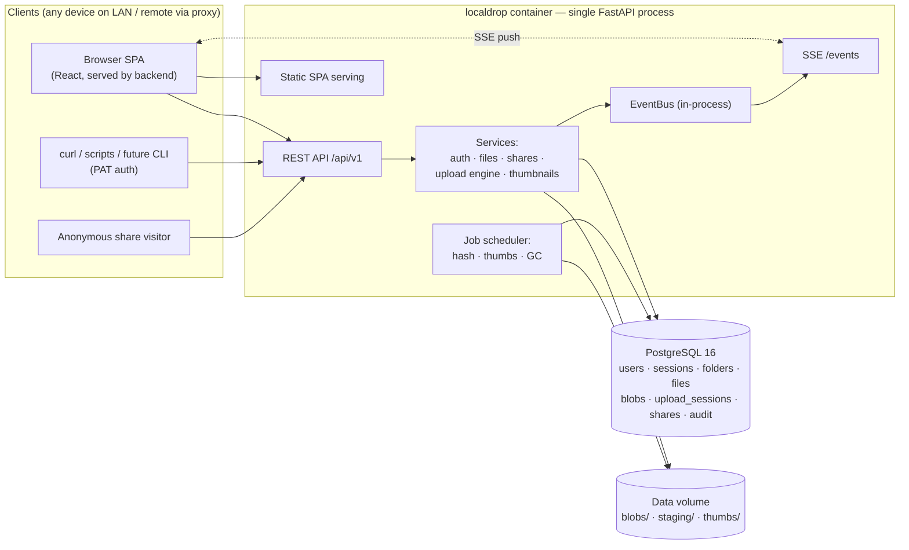
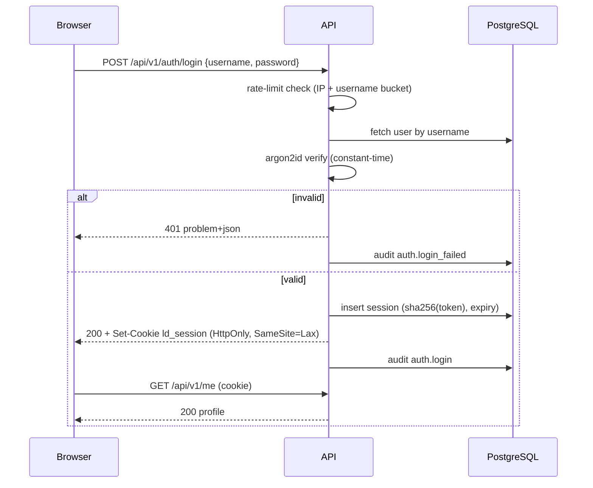
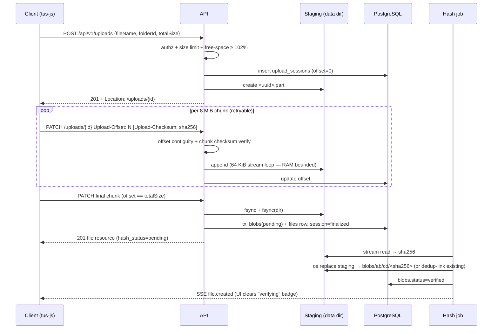
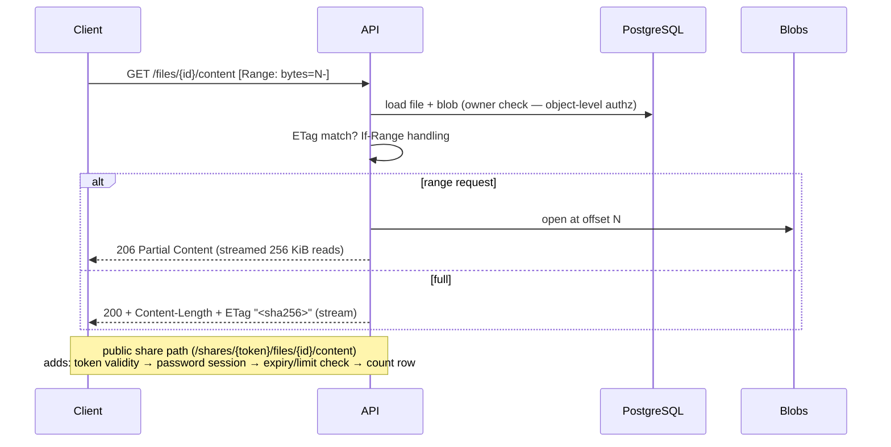
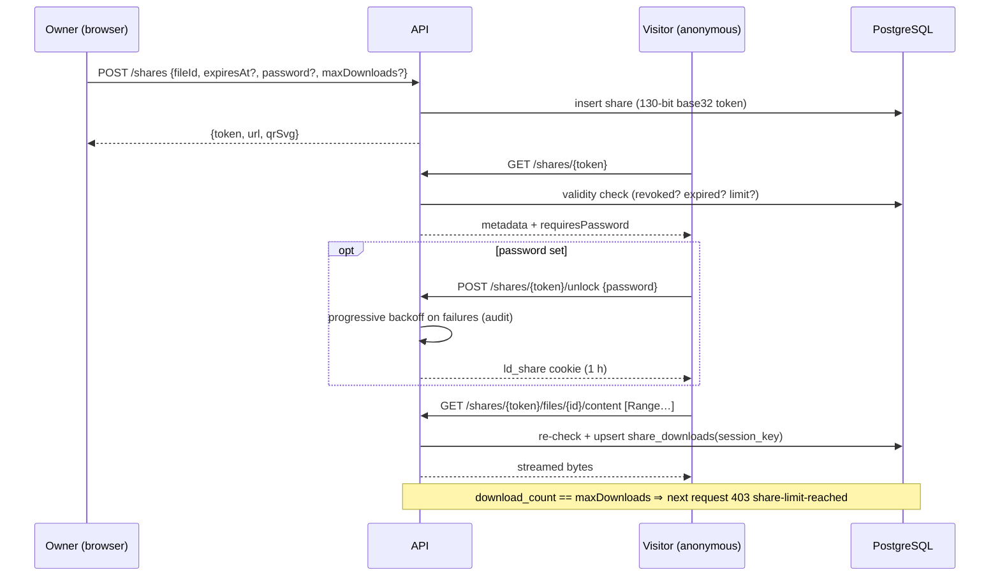
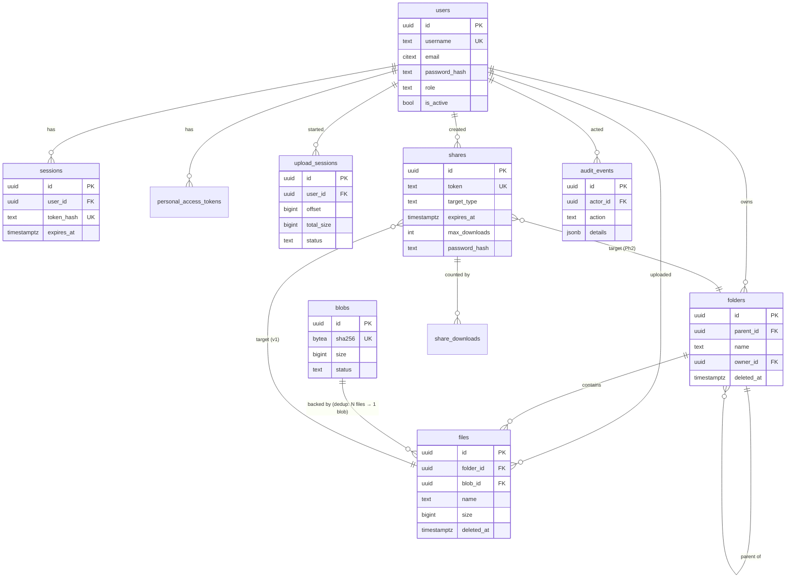
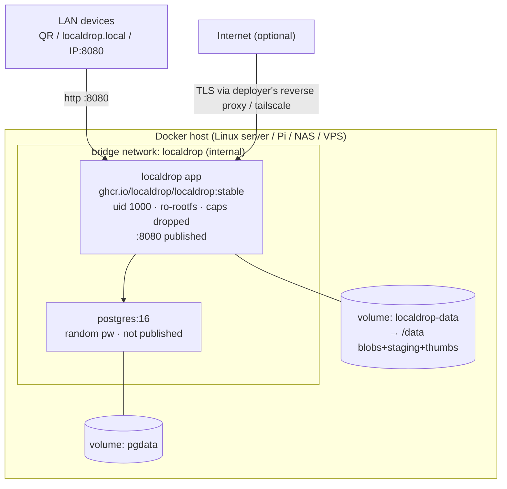
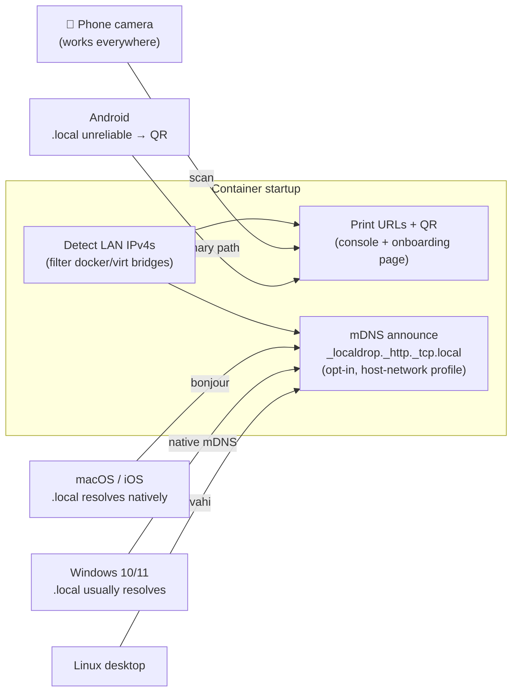
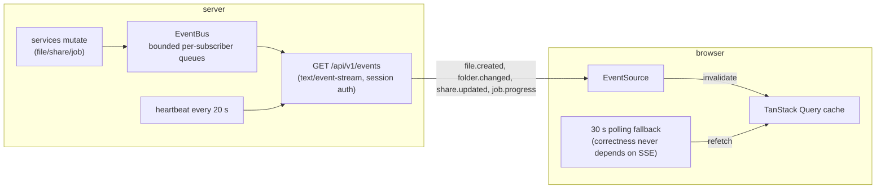

# 09 — Architecture Diagrams (Mermaid)

*Status: Proposed. These render on GitHub. Keep them in sync — a diagram that
disagrees with ADRs loses to ADRs.*

---

## 1. System architecture

---

## 2. Authentication flow (login)

Onboarding pre-step: first run prints a one-time setup token in the container
console; `POST /setup/owner` consumes it and creates the owner (06 §3).

---

## 3. File upload flow (tus resumable)

Failure handling for every step is specified in 03 §5.3 (crash, corruption,
disk-full, restart — all resume or GC).

---

## 4. File download flow (streaming + range)

---

## 5. Share-link flow (public)

---

## 6. Database relationships (ERD)

---

## 7. Docker deployment

---

## 8. Local-network discovery

Honesty matrix with caveats: 03 §7.

---

## 9. Real-time communication (SSE)

---

*Next: [10 — Risks & open questions](10-risks-open-questions.md).*
